**KEYESTUDIO Plus STEM Starter Kit For Arduino**

**Table of Contents**

[1.Introduction 2](#_Toc224)

[2.Part List 3](#_Toc13526)

[3.KEYESTUDIO Plus Development Board 4](#_Toc18729)

[4.Installing Driver For Windows 6](#_Toc10685)

[4.1 Download Software 7](#_Toc25797)

[4.2 Installing Driver For windows 11](#_Toc15633)

[4.3 Configure Arduino IDE 15](#_Toc30962)

[5.Installing Driver For MAC 21](#_Toc5169)

[5.1 Download Software 21](#_Toc15941)

[5.2 Download the Driver of CP2102 22](#_Toc21313)

[5.3 How to Install the Driver of CP2102 22](#_Toc1678)

[6. Install the Libraries to Arduino 35](#_Toc21012)

[6.1 Manual installation 36](#61-manual-installation)

[6.2 Using the Library Manager 38](#_Toc27915)

[6.3 Importing a .zip Library 41](#63-importing-a-zip-library)

# 1.Introduction

Do you want to acquire programming knowledge? As long as you are passionate
about science and dare to explore new things, this STEM starter kit must be your
best choice.

KEYESTUDIO STEM Starter Kit is a programming learning kit based on Arduino. With
a controller, numerous sensors, modules and electronic components, you can do
many different DIY projects.

This kit also comes with 28 projects tutorials, which are entirely suitable for
beginners. Each tutorial has detailed wiring diagrams and fascinating Project
Codes. You can learn electronics, physics, science and programming knowledge.

**2.Part List**

|              |  |  |  |                             |                                                                                                    |
|-------------------------------------------------------------|-------------------------------------------------------------------------|--------------------------------------------------------------------------|-------------------------------------------------------------------------|----------------------------------------------------------------------------|---------------------------------------------------------------------------------------------------------------------------------------------------|
| Plus board\*1                                               | LED - Blue\*5                                                           | LED - Red\*5                                                             | LED - Yellow\*5                                                         | LED - Green\*5                                                             | LED - RGB\*1                                                                                                                                      |
|             |                         |                          |                          |     |                                                                             |
| 220Ω Resistor\*10                                           | 10KΩ Resistor\*10                                                       | 1KΩ Resistor\*10                                                         | 10KΩ Potentiometer\*1                                                   | Buzzer (Active)\*1                                                         | Buzzer (Passive)\*1                                                                                                                               |
|          |                          |                           |                          |                             |                                                                                                    |
| Button Switch\*4                                            | Ball Tilt Sensor\*2                                                     | Photo Cell\*3                                                            |  Flame Sensor\*1                                                        | LM35 Temp Sensor\*1                                                        | IC 74HC595N \*1                                                                                                                                   |
|              |                          |                           |                          |  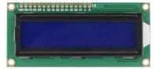  |                                                                                                    |
| TIP122 Transistor\*1                                        | 1 Digital Tube Display\*1                                               | 4 Digital Tube Display\*1                                                | 8\*8 LED Matrix\*1                                                      | 1602 I2C LCD \*1                                                           | IR Receiver\*1                                                                                                                                    |
|            |  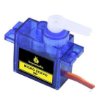                        |                           |                          | 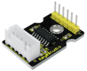                            |  |
| IR Remote Control\*1                                        | Servo Motor\*1                                                          | 130 Motor Propeller\*1                                                   | 130 Dc Motor\*1                                                         | Stepper Driver\*1                                                          | Stepper Motor\*1                                                                                                                                  |
|   |                          |                           |                          |                             |                                                                                                    |
| Joystick Module\*1                                          | Sound Sensor\*1                                                         | PIR Motion Sensor\*1                                                     | HC-SR04 Ultrasonic\*1                                                   | DHT11 Sensor\*1                                                            | 400-hole Breadboard\*1                                                                                                                            |
|              | 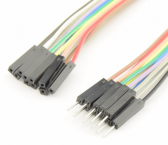                         |                           | 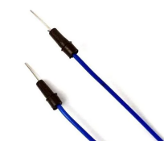                         | 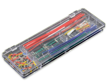                            | 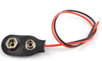                                                                                                   |
| Arduino holder\*1                                           | Male to Female Dupont Wire\*10                                          | Female to Female Dupont Wire\*10                                         | Flexible jumper Wire\*20                                                | Preformed Jumper Wire\*1                                                   | 9v Battery Connector\*1                                                                                                                           |
|  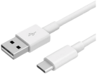            |                          |                           |                          |                             |                                                                                                                                                   |
| Type c USB Cable\*1                                         | Cartoon paper                                                           | Cartoon paper                                                            | Cartoon paper                                                           | Resistor card                                                              |                                                                                                                                                   |

**3.KEYESTUDIO Plus Development Board**

Before we get started with the KEYESTUDIO STEM Starter Kit, we first introduce
the Plus Development Board, it is the core of all the projects.

KEYESTUDIO Plus Development Board is fully compatible with Arduino and contains
all the functions of the Arduino UNO R3, but it is more powerful than the
Arduino UNO R3. It is the best choice to learn how to build circuits and design
your own code. Let us get more detailed information about it.

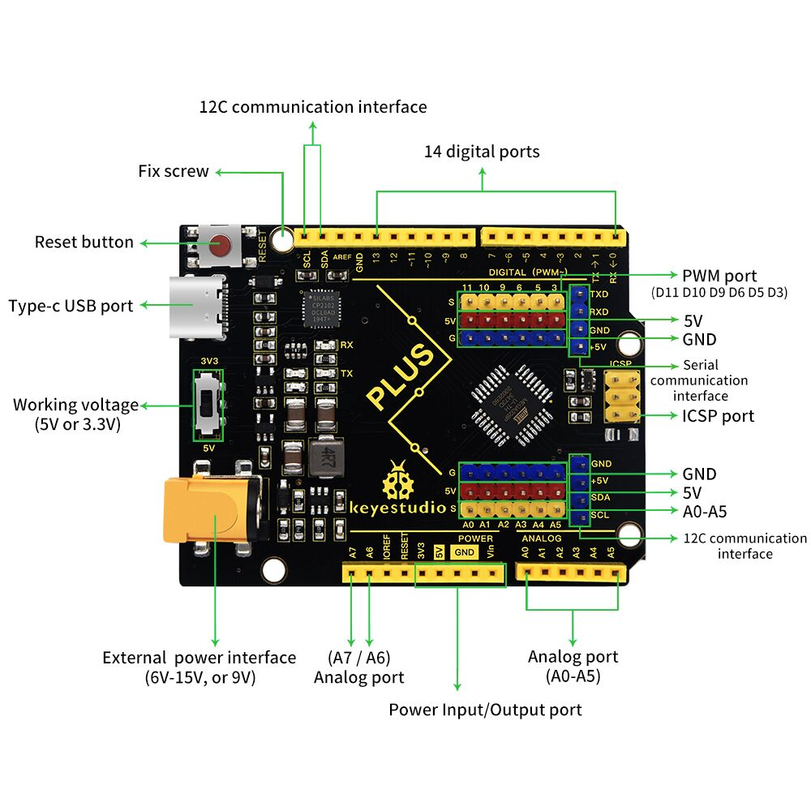

Serial communication interface: D0 is RX, D1 is TX

PWM interface (pulse width modulation): D3 D5 D6 D9 D10 D11

External interrupt interface: D2 (interrupt 0) and D3 (interrupt 1)

SPI communication interface: D10 is SS, D11 is MOSI, D12 is MISO, D13 is SCK

IIC communication port: A4 is SDA, A5 is SCL

**4.Installing Driver for Windows**

**4.1 Download Software**

Arduino IDE is the open-source Software makes it easy to write code and upload
it to the board. When getting the control board, we first need to install
Arduino IDE

Go to the website <https://www.arduino.cc/> and you will see the following page.

Clickand

Then you will see a page where you can download the latest version of the IDE.
There are the Installer (.exe) and the Zip packages you can choose for Windows.
We suggest you use the first one that installs directly everything you need to
use the Arduino Software (IDE), including the drivers. With the Zip package you
need to install the drivers manually. The Zip file is also useful if you want to
create a portable installation.

Pull down this page, you can also click "previous version of the current
release" to enter another page to select and install the previous version of
Arduino Software.

In this project, we choose Installer (.exe) for Windows.

Click Windows Win 7 and newer and JUST DOWNLOAD.

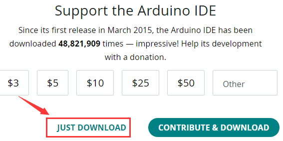

The download file: 

Double-click the arduino IDE (.exe) file

Choose "I Agree" to see the following interface.

Choose "Next" to see the following interface.

Press "Install" to initiate installation.

If the following interface appears, you should choose “Install”.

## 4.2 Installing Driver on Windows

Before using the KEYESTUDUO Plus Control Board, you must install the driver of
it, otherwise it will not communicate with computer.

Unlike the USB series chip (ATMEGA8U2) of the Arduino UNO R3, the KEYESTUDIO
Plus Development Board is used the CP2102 chip USB series chip and USB type C
interface.

The driver of the CP2102 chip is included in 1.8.0 version and newer version of
Arduino IDE. Usually, you connect the board to the computer and wait for Windows
to begin its driver installation process. After a few moments, the process will
succeed.

If the driver installation process fail, you need to install the driver
manually.

Note:

1\. Please make sure that your IDE is updated to 1.8.0 or newer version

2.If the version of Arduino IDE you download is below 1.8, you should download
the driver of CP2102 and install it manually.

Link to download the driver of CP2102:

[**https://fs.keyestudio.com/CP2102-WIN**](https://fs.keyestudio.com/CP2102-WIN)

To install the drive manually, open the device manager of computer.

Right click Computer----- Click Properties-----Click Device Manager.

Look under Ports (COM & LPT) or other device.

A yellow exclamation mark means that the CP2102 driver installation failed.

Double-click the font with yellow exclamation mark and clich “OK”

Click “browse my computer for updated driver software”.

Navigate to the "Drivers" folder of the Arduino Software you have download and
click “Next” to install the drive.

The driver is installed successfully.

Open device manager, we will find the yellow exclamation mark disappear. The
driver of CP2102 is installed successfully.

## 4.3 Configure Arduino IDE

After the driver is successfully installed, it’s time to configure the IDE to
use the same device and port to start uploading code.

For the KEYESTUDIO Plus Control Board, we should navigate to Tools \> Board \>
and select Arduino Uno(as shown below). However, if you are using a different
board (i.e., not the Arduino Uno or KEYESTUDIO Plus Control Board), you must
select the proper board!

Then select the correct COM port.

You can see the corresponding COM port after the driver is successfully
installed.

Navigate to Tools \> Port \>COM7

The function of each symbol in the Arduino IDE toolbar.

A- verify whether there is any compiling mistakes or not.

B- upload the sketch to your Arduino board.

C- create shortcut window of a new sketch.

D- directly open an example sketch.

E- save the sketch.

F- send the serial data received from board to the serial monitor.

4.4 Start First Program

Click File -\> Examples -\> 01.Basics -\>Blink

When the sketch window opens, you can see the entire sketch in the window.

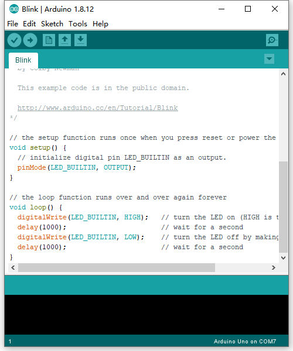

Choose the correct board type and COM port

Clickto upload the code.

Dode uploarding!

The onboard LED lights on for 1s, lights off for 1s.

Congratulation, you finish the first program.

**5.Installing Driver on MAC**

5.1 Download Software

Click and download Arduino IDE for MAC system :

5.2 Download the Driver of CP2102

<https://fs.keyestudio.com/CP2102-MAC>

5.3 How to Install the Driver of CP2102

Connect the Plus development board to your computer, and open Arduino IDE

Click Tools to configure Board and Port: Arduino Uno and /dev/cu.usbserial-0001

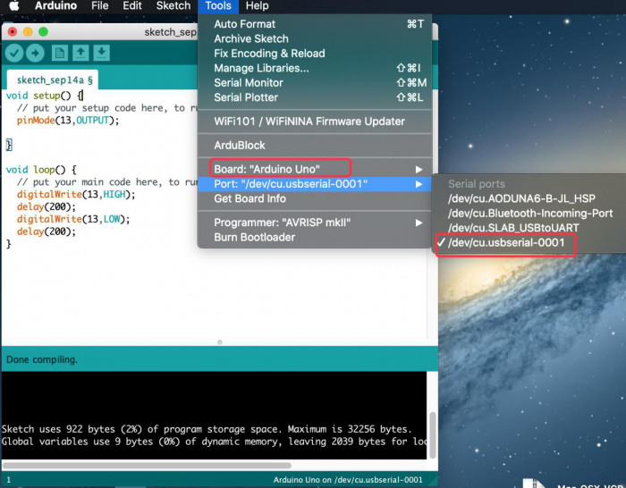

Tap Upload to upload code, if burn successfully, you will view done uploading.

**Note: If burn unsuccessfully, you need to install driver of CP2102, please
continue to follow the instructions as below:**

Download the driver of CP2102:

[**https://www.silabs.com/products/development-tools/software/usb-to-uart-bridge-vcp-drivers**](https://www.silabs.com/products/development-tools/software/usb-to-uart-bridge-vcp-drivers)

1.Select Mac OSX edition

2.Unzip the downloaded package

3.Open folder and double-click SiLabsUSBDriverDisk.dmg file.

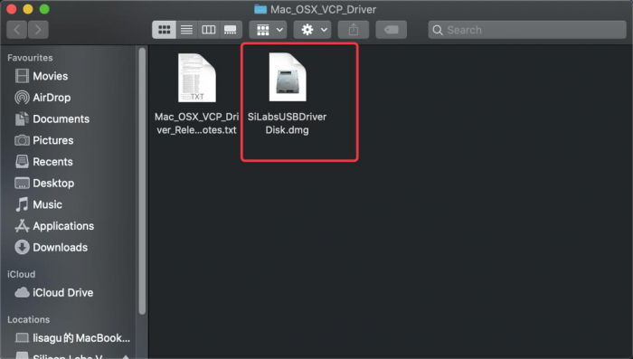

4.You will view the following files as follows:

5\. Double-click Install CP210x VCP Driver, tick Don’t warn me and tap Open

6\. Tap Continue

7\. Tap Continue and Agree

8.Click Continue and input your password

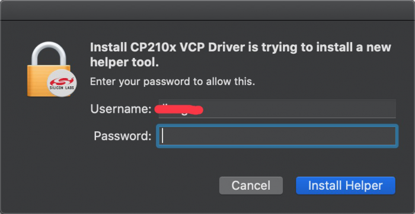

9.Select Open Security Preferences

10.Click the lock to unlock security & privacy preference.

11.Then click Allow

12.Back to installation page, and wait to install.

13.Successfully installed

14.Then enter ArduinoIDE, click Tools and select Board: Arduino Uno and
/dev/cu.SLAB_USBtoUAPT

15.Click to upload code
and you will see “Done uploading”.

**6. Import Libraries**

What are Libraries ?

[Libraries](https://www.arduino.cc/en/Reference/Libraries) are a collection of
code that makes it easy for you to connect to a sensor,display, module, etc.

For example, the built-in LiquidCrystal library helps talk to LCD displays.
There are hundreds of additional libraries available on the Internet for
download.

The built-in libraries and some of these additional libraries are listed in the
reference（https://www.arduino.cc/en/Reference/Libraries）.

How to Install a Library

## 6.1 Manual installation

When you want to add a library manually, first quit the Arduino application,
then you need to download library as a ZIP file, expand it and put in the proper
directory.

For example, we will install the IR Remote Library which can be found on GitHub:
<https://github.com/shirriff/Arduino-IRremote>

First, download the library as a ZIP, which is done by clicking the green “Code”
button and then clicking “Download ZIP”.

Once downloaded, Unzip the the IR Remote Library package.

Then navigate to your Arduino folder.

Open the“Libraries”folder in the Arduino folder and then drag the
“Arduino-IRremote-master”folder into the libraries folder.

The library file is manually installed.

**6.2 Using the Library Manager**

To install a new library into your Arduino IDE you can use the Library Manager
(available from IDE version 1.6.2). Open the IDE and click to the "Sketch" menu
and then Include Library \> Manage Libraries.

Then the Library Manager will open and you will find a list of libraries that
are already installed or ready for installation. In this example we will install
the Bridge library. Scroll the list to find it, click on it, then select the
version of the library you want to install. Sometimes only one version of the
library is available. If the version selection menu does not appear, don't
worry: it is normal.

Finally click on install and wait for the IDE to install the new library.
Downloading may take time depending on your connection speed. Once it has
finished, an Installed tag should appear next to the Bridge library. You can
close the library manager.

You can now find the new library available in the Sketch \> Include Library
menu.

## 6.3 Importing a .zip Library

Open the Arduino IDE, navigate to Sketch \> Include Library. At the top of the
drop down list, select the option to "Add .ZIP Library''.

We will install the IR Remote Library which can be found on GitHub:
<https://github.com/shirriff/Arduino-IRremote>

First, download the library as a ZIP, which is done by clicking the green “Code”
button and then clicking “Download ZIP”.

Navigate to the .zip file's location and open it.

Return to the Sketch \> Import Library menu.

You should now see the library at the bottom of the drop-down menu.
