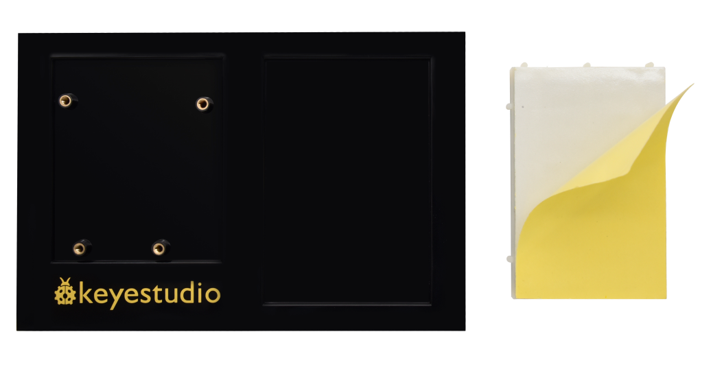
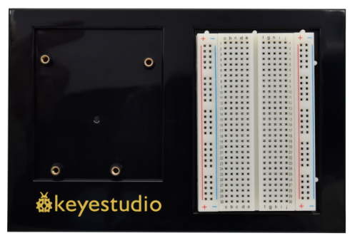

## Project 1: Hello World

**1.Project Introduction**

For Arduino starters, we will begin with something simple. In this project, you
will only need a Plus development board and a USB cable to complete the "Hello
World!" project. It is not only a communication test of your Arduino board and
the PC, but also a primer project in the Arduino world!

**2.Project Hardware**

|  |  |  |  |  |
|-------------------------------------------------|-------------------------------------------------|-------------------------------------------------|-------------------------------------------------|-------------------------------------------------|
| Plus Board\*1                                   | Board Holder                                    | 400-Hole Breadboard                             | USB Cable\*1                                    | Hello World Card\*1                             |

1.  **Assembly Project Platform**

Before starting the project, we will install the Plus Development Board and
400-Hole breadboard onto the board holder.

1.  Remove the adhesive sticker of the breadboard.

1.  Attach the breadboard to the board holder

1.  Use three plastic columns to fix the PLUS development board on the board
    holder.

The assembly of the project platform is complete.

**4.Project Code**

A simple **If () statement** programming control structure will be used. Arduino
uses a serial monitor for displaying information such as print statements,
sensor data, and so on. This is a very powerful tool for debugging long codes.
Now for your first code!

/\*

keyestudio STEM Starter Kit

Project 1

Hello World

http//www.keyestudio.com

\*/

int val;//define variable val

void setup()

{

Serial.begin(9600);// set the baud rate at 9600 .

}

void loop()

{

val=Serial.read();// read the instruction or character from PC to Arduino, and
assign them to Val.

if(val=='R')// determine if the instruction or character received is “R”.

{ // if it’s “R”,

Serial.println("Hello World!");// display“Hello World！”string.

}}

/////////////////////////////////////////////////////////////////

**5.Project Result**

Double-click icon to enter serial
monitor.

Every time you enter an "R" in the text box and click “send”, the onboard LED on
the plus board will flash once, and the serial monitor will display a Hello
World!

