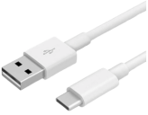

## Project 10: A Small Desk Lamp

**1.Project Introduction**

In fact, you can use Arduino to turn on an LED. In this project, we will use a
cartoon lamp card, a button switch and an LED to make a small desk lamp.

**2.Project Hardware**

|      |    |  |  |
|-----------------------------------------------------|---------------------------------------------------|-------------------------------------------------|-------------------------------------------------|
| Plus Development Board\*1                           | Plus Board Holder                                 | 400-Hole Breadboard                             | USB Cable\*1                                    |
|  |    |  |  |
| Button switch\*1                                    | Red M5 LED \*1                                    | 10KΩ Resistor\*1                                | 220Ω Resistor\*1                                |
|      |    |                                                 |                                                 |
| Preformed&Flexible Jumper Wire                      | Desk lamp Paper Card\*1                           |                                                 |                                                 |

**3.Little Knowledge**

The button is a component that connects two points in a circuit when you press
it.

**Schematic Diagrams:**  

**4. Circuit Connection**

**NOTE:**

How to connect an LED

How to identify 5 band 220Ω Resistor and a 5 band 10KΩ Resistor

**5.Project Code**

/\*

keyestudio STEM Starter Kit

Project 10

Small desktop lamp

http//www.keyestudio.com

\*/

int ledpin=12;// initialize pin 12

int inpin=5;// initialize pin 5

int val;// define val

void setup()

{

pinMode(ledpin,OUTPUT);// set LED pin as “output”

pinMode(inpin,INPUT);// set button pin as “input”

}

void loop()

{

val=digitalRead(inpin);// read the level value of pin 7 and assign if to val

if(val==LOW)// check if the button is pressed, if yes, turn on the LED

{ digitalWrite(ledpin,LOW);}

else

{ digitalWrite(ledpin,HIGH);}

}

//////////////////////////////////////////////////////////////////

1.Open up the Arduino IDE and copy the above code into a new sketch.

2.Select the correct **Board type** and **COM** port for the Arduino IDE.

3.Click **Upload** to upload the code.

**6.Project Result**

Done uploading！We simulate a desk lamp.

When the button is pressed, LED will be on, otherwise, it remains off. In this
way, the small desk lamp project is completed.

