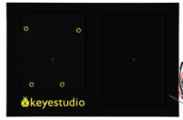

**Project11: Digital Hourglass**

**1.Project Introduction**

Once upon a time, people used hourglasses to measure time.

Today, we DIY a digital hourglass by using a hourglass Paper Card, a Plus
Development Board, 5 Red M5 LEDs, a Ball switch.

1.  **Project Hardware**

|  |  |  |  |
|-------------------------------------------------|-------------------------------------------------|-------------------------------------------------|-------------------------------------------------|
| Plus Development Board\*1                       | Plus Board Holder                               | 400-Hole Breadboard                             | USB Cable\*1                                    |
|  |  |  |  |
| Ball switch\*1                                  | Red M5 LED \*5                                  | 10KΩ Resistor\*1                                | 220Ω Resistor\*5                                |
|  |  |                                                 |                                                 |
| Jumper Wire\*12                                 | hourglass Paper Card\*1                         |                                                 |                                                 |

**3.Working Principle**

The ball switch is a digital switch. There is a metal ball inside it that can
roll. The principle of the metal ball rolling and contacting the guide pin is
used to control the on or off of the circuit.

When one end of the switch is below horizontal position, the switch is on. The
voltage of the analog port is about 5V (1023 in binary). The LED will be on.

When the other end of the switch is below horizontal position, the switch is
off. The voltage of the analog port is about 0V (0 in binary). The LED will be
off.   
In the program, we determine whether the switch is on or off according to the
voltage value of the analog port, whether it's above 2.5V (512 in binary) or
not.

**4.Circuit Connection**

**NOTE:**

How to connect an LED

How to identify 5 band 220Ω Resistor and a 5 band 10KΩ Resistor

**5.Project Code**

/\*

keyestudio STEM Starter Kit

Project 11

Digital Hourglass

http//www.keyestudio.com

\*/

const byte SWITCH_PIN = 4; // connect tilt switch to D4

byte switch_state = 0;

void setup()

{

for(int i=8;i\<12;i++)

{

pinMode(i, OUTPUT);

}

pinMode(SWITCH_PIN, INPUT);

for(int i=8;i\<12;i++)

{

digitalWrite(i,0);

}

Serial.begin(9600);

}

void loop()

{

switch_state = digitalRead(SWITCH_PIN);

Serial.println(switch_state);

if (switch_state == 0)

{

for(int i=8;i\<12;i++)

{

digitalWrite(i,1);

delay(1000);

}

}

if (switch_state == 1)

{

for(int i=11;i\>7;i--)

{

digitalWrite(i,0);

delay(1000);

}

}

}//////////////////////////////////////////////////////////////////

1.Open up the Arduino IDE and copy the above code into a new sketch.

2.Select the correct Board type and COM port for the Arduino IDE.

3.Click Upload button to upload the code.

**6.Project Result**

Hold the breadboard with your hands. Tilt to a certain angle, the LEDs will
light up one by one. When returning to the previous angle, the LEDs will turn
off one by one. Just like an hourglass, the sand leaked out over time.

