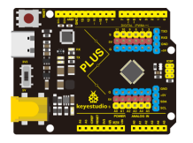
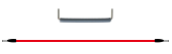

## Project 12: A Guard Dog

****

**1.Project Introduction**

PIR sensors measure infrared (IR) light radiating from moving objects that emit
heat. The sensor allows you to detect motion of people, animals and cars to
trigger security alarms and lighting. They are used to detect movement and are
ideal for security and safety such as burglar alarms and security lighting
systems.

In this project, we will use a PIR motion sensor, a buzzer, and a cartoon dog
card to make a guard dog that sounds when someone or an animal moves nearby.

1.  **Project Hardware**

|  |                         |  |  |
|-------------------------------------------------|------------------------------------------------------------------------|-------------------------------------------------|-------------------------------------------------|
| Plus Development Board\*1                       | Plus Board Holder                                                      | 400-Hole Breadboard                             | USB Cable\*1                                    |
|  |  |  |  |
| PIR Motion Sensor\*1                            | Passive Buzzer\*1                                                      | Jumper Wire\*5                                  | Guard dog Paper Card\*1                         |

**3.PIR Motion Sensor Specification**

-   Input Voltage 3.3 \~ 5V (6V Maximum)

-   Working Current 15uA

-   Working Temperature -20 \~ 85 ℃

-   Output Voltage High 3V, Low 0V

-   Output Delay Time (High Level) About 2.3 to 3 Seconds

-   Detection Angle 100 °

-   Detection Distance 7 meters

-   Output Indicator LED (When output HIGH, it will be ON)

-   Pin limit Current 100mA

**4.Circuit Connection**

**5.Project Code**

/\*

keyestudio STEM Starter Kit

Project 12

Guard dog

http//www.keyestudio.com

\*/

int buzzerpin = 8; // buzzer pin

int pirPin = 3; // PIR Out pin

int pirStat = 0; // PIR status

void setup() {

pinMode(buzzerpin, OUTPUT);

pinMode(pirPin, INPUT);

Serial.begin(9600);

}

void loop()

{

pirStat = digitalRead(pirPin);

if (pirStat == HIGH)

{ // if motion detected

digitalWrite(buzzerpin, HIGH); // turn buzzer ON

Serial.println("Hey I got you!!!");

}

else {

digitalWrite(buzzerpin, LOW); // turn buzzer OFF if we have no motion

}

}//////////////////////////////////////////////////////////

1.Open up the Arduino IDE and copy the above code into a new sketch.

2.Select the correct Board type and COM port for the Arduino IDE.

3.Click Upload button to upload the code.

**6.Project Result**

If the PIR motion sensor detects someone moving nearby, the buzzer will sound an
alarm, and click to open the serial monitor on the Arduino IDE, you will see
"Hey I got you!!!".

