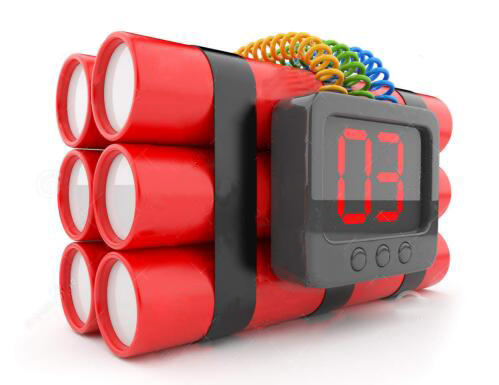
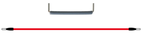
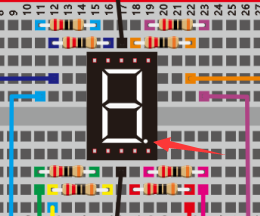
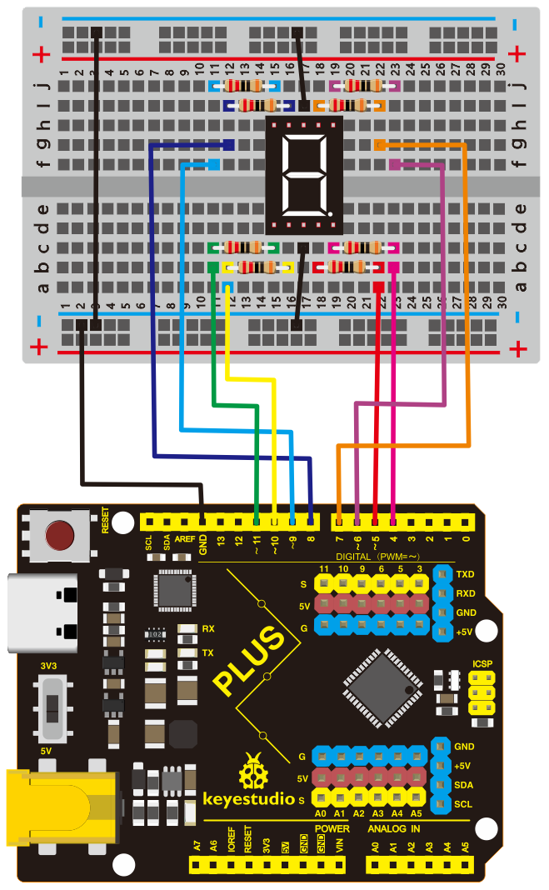
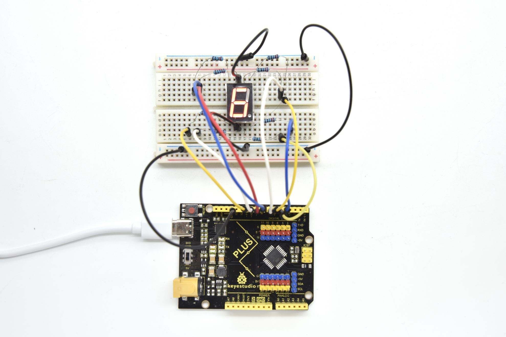

**Project 13: DIY A Time Bomb**

**1.Project Introduction**

A seven-segment display is a form of the electronic display device for
displaying decimal numerals, they are widely used in digital clocks, electronic
meters, basic calculators, and other electronic devices that display numerical
information. Even the bombs we saw in the movie have seven-segment displays.

Perhaps seven-segment displays don’t look modern enough for you, but they are
alternatives to the more complex dot matrix displays and are easy to use both in
limited light conditions and in strong sunlight.

In this project, we will make a simple time bomb with a 1-digit LED Segment
Display.

1.  **Project Hardware**

|   |    |  |  |
|--------------------------------------------------|---------------------------------------------------|-------------------------------------------------|-------------------------------------------------|
| Plus Development Board\*1                        | Plus Board Holder                                 | 400-Hole Breadboard                             | USB Cable\*1                                    |
|   |    |  |                                                 |
| 1-digit LED Segment Display\*1                   | 220Ω Resistor\*8                                  | Jumper Wire\*10+                                |                                                 |

**3. 1-digit LED Segment Display principle**

LED segment display is a semiconductor light-emitting device. Its basic unit is
a light-emitting diode (LED).

LED segment display can be divided into the 7-segment display and 8-segment
display according to the number of segments. The 8-segment display has one more
LED unit ( for decimal point display) than 7-segment one.

Each segment of the seven segment LED display is an individual LED. According to
the wiring method of LED units, LED segment displays can be divided into common
anode displays and common cathode displays.

In a Common Cathode seven segment display. All of the cathodes (or negative
terminals) of the segment LEDs are connected together. You should connect the
common cathode to GND. To turn on a segment, you set its associated pin to HIGH

In a Common Anode seven segment display, the anodes (positive terminals) of all
of the segments are connected together. You should connect the common anode to
\+5V. To turn on a segment, you set its associated pin to LOW.

Each segment of the display consists of an LED. So when you use it, you also
need to use a current-limiting resistor. Otherwise, LED will be burnt out.

In this experiment, we use a common cathode display. As we mentioned above, you
should connect the common cathode to GND. To turn on a segment, you set its
associated pin to HIGH。

**4.Circuit Connection**

**NOTE：**

The direction of the seven-segment display inserted into the panel is consistent
with the wiring diagram, and an extra point is in the lower right corner

**5.Project Code**

There are seven segments for numerical display, one for decimal point display.
Corresponding segments will be turned on when displaying certain numbers.

For example, when displaying number 1, b and c segments will be turned on. We
compile a subprogram for each number, and compile the main program to display
one number every 2 seconds, cycling display number 0 \~ 9.

The displaying time for each number is subject to the delay time, the longer the
delay time, the longer the displaying time.

/\*

keyestudio STEM Starter Kit

Project 13

Bomb Timer

http//www.keyestudio.com

\*/

// set the IO pin for each segment

int a=7;// set digital pin 7 for segment a

int b=6;// set digital pin 6 for segment b

int c=5;// set digital pin 5 for segment c

int d=10;// set digital pin 10 for segment d

int e=11;// set digital pin 11 for segment e

int f=8;// set digital pin 8 for segment f

int g=9;// set digital pin 9 for segment g

int dp=4;// set digital pin 4 for segment dp

void digital_0(void) // display number 5

{

unsigned char j;

digitalWrite(a,HIGH);

digitalWrite(b,HIGH);

digitalWrite(c,HIGH);

digitalWrite(d,HIGH);

digitalWrite(e,HIGH);

digitalWrite(f,HIGH);

digitalWrite(g,LOW);

digitalWrite(dp,LOW);

}

void digital_1(void) // display number 1

{

unsigned char j;

digitalWrite(c,HIGH);// set level as “high” for pin 5, turn on segment c

digitalWrite(b,HIGH);// turn on segment b

for(j=7;j\<=11;j++)// turn off other segments

digitalWrite(j,LOW);

digitalWrite(dp,LOW);// turn off segment dp

}

void digital_2(void) // display number 2

{

unsigned char j;

digitalWrite(b,HIGH);

digitalWrite(a,HIGH);

for(j=9;j\<=11;j++)

digitalWrite(j,HIGH);

digitalWrite(dp,LOW);

digitalWrite(c,LOW);

digitalWrite(f,LOW);

}

void digital_3(void) // display number 3

{digitalWrite(g,HIGH);

digitalWrite(a,HIGH);

digitalWrite(b,HIGH);

digitalWrite(c,HIGH);

digitalWrite(d,HIGH);

digitalWrite(dp,LOW);

digitalWrite(f,LOW);

digitalWrite(e,LOW);

}

void digital_4(void) // display number 4

{digitalWrite(c,HIGH);

digitalWrite(b,HIGH);

digitalWrite(f,HIGH);

digitalWrite(g,HIGH);

digitalWrite(dp,LOW);

digitalWrite(a,LOW);

digitalWrite(e,LOW);

digitalWrite(d,LOW);

}

void digital_5(void) // display number 5

{

unsigned char j;

digitalWrite(a,HIGH);

digitalWrite(b, LOW);

digitalWrite(c,HIGH);

digitalWrite(d,HIGH);

digitalWrite(e, LOW);

digitalWrite(f,HIGH);

digitalWrite(g,HIGH);

digitalWrite(dp,LOW);

}

void digital_6(void) // display number 6

{

unsigned char j;

for(j=7;j\<=11;j++)

digitalWrite(j,HIGH);

digitalWrite(c,HIGH);

digitalWrite(dp,LOW);

digitalWrite(b,LOW);

}

void digital_7(void) // display number 7

{

unsigned char j;

for(j=5;j\<=7;j++)

digitalWrite(j,HIGH);

digitalWrite(dp,LOW);

for(j=8;j\<=11;j++)

digitalWrite(j,LOW);

}

void digital_8(void) // display number 8

{

unsigned char j;

for(j=5;j\<=11;j++)

digitalWrite(j,HIGH);

digitalWrite(dp,LOW);

}

void digital_9(void) // display number 5

{

unsigned char j;

digitalWrite(a,HIGH);

digitalWrite(b,HIGH);

digitalWrite(c,HIGH);

digitalWrite(d,HIGH);

digitalWrite(e, LOW);

digitalWrite(f,HIGH);

digitalWrite(g,HIGH);

digitalWrite(dp,LOW);

}

void setup()

{

int i;// set variable

for(i=4;i\<=11;i++)

pinMode(i,OUTPUT);// set pin 4-11as “output”

}

void loop()

{

while(1)

{

digital_9();// display number 9

delay(1000); // wait for 1s

digital_8();// display number 8

delay(1000); // wait for 1s

digital_7();// display number 7

delay(1000); // wait for 1s

digital_6();// display number 6

delay(1000); // wait for 1s

digital_5();// display number 5

delay(1000); // wait for 1s

digital_4();// display number 4

delay(1000); // wait for 1s

digital_3();// display number 3

delay(1000); // wait for 1s

digital_2();// display number 2

delay(1000); // wait for 1s

digital_1();// display number 1

delay(1000);// wait for 1s

digital_0();// display number 0

delay(1000);// wait for 1s

}}

//////////////////////////////////////////////////////////////////

1.Open up the Arduino IDE and copy the above code into a new sketch.

2.Select the correct Board type and COM port for the Arduino IDE.

3.Click Upload button to upload the code.

**6.Project Result**

Done uploading the code! The LED segment display will show the number from 9 to
0, at this time an interesting time bomb is complete.

