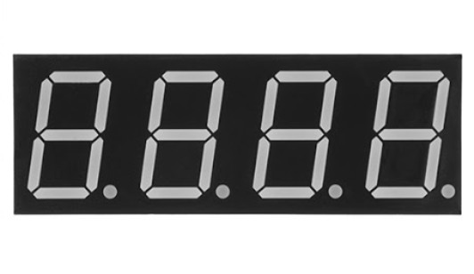

**Project 14: Hand Counter**

****

**1.Project Introduction**

4-digit 7-segment LED display is a very practical display device. The display of
electronic clocks, the scorer on the court, and the number of people in the park
are all needed.

Because of its low price and easy use, more and more projects will use 4-digit
7-segment LED display.

In this project, we use 4-digit 7-segment LED display to make a hand counter.

1.  **Project Hardware**

|  |   |  |       |
|-------------------------------------------------|--------------------------------------------------|-------------------------------------------------|------------------------------------------------------|
| Plus Development Board\*1                       | Plus Board Holder                                | 400-Hole Breadboard                             | USB Cable\*1                                         |
|  |   |  |   |
| 4-digit LED Segment Display\*1                  | 220Ω Resistor\*8                                 | Jumper Wire\*10+                                | Button Switch\*1                                     |
|  |                                                  |                                                 |                                                      |
| 10KΩ Resistor\*1                                |                                                  |                                                 |                                                      |

**3.The Principle of 4-digit Display**

For 4-digit display, there are 12 pins in total. When you place the decimal
point downward, the pin on the lower left part is referred to as 1, the upper
left part 12.

**4.Circuit Connection**

For LED display, current-limiting resistors are indispensable. Here We use 8
Resistors of 220Ω.

1.  **Project Code**

/\*

keyestudio STEM Starter Kit

Project 14

Hand Counter

http//www.keyestudio.com

\*/

int a = 1;

int b = 2;

int c = 3;

int d = 4;

int e = 5;

int f = 6;

int g = 7;

int dp = 8;

int d4 = 9;

int d3 = 10;

int d2 = 11;

int d1 = 12;

// set variable

volatile int PushCounter;

volatile int State;

volatile int lastState;

int val1=0;

int val2=0;

int val3=0;

int val4=0;

void setup()

{

pinMode(d1, OUTPUT);

pinMode(d2, OUTPUT);

pinMode(d3, OUTPUT);

pinMode(d4, OUTPUT);

pinMode(a, OUTPUT);

pinMode(b, OUTPUT);

pinMode(c, OUTPUT);

pinMode(d, OUTPUT);

pinMode(e, OUTPUT);

pinMode(f, OUTPUT);

pinMode(g, OUTPUT);

pinMode(dp, OUTPUT);

PushCounter = 0;

State = 0;

lastState = 0;

pinMode(13, INPUT);

}

/////////////////////////////////////////////////////////////

void loop()

{

unsigned long currentMillis = millis();

while(1)

{

while(millis()-currentMillis\<100)

{

Display(1, val1);

Display(2, val2);

Display(3, val3);

Display(4, val4);

}

currentMillis = millis();

State = digitalRead(13);

if (State != lastState) {

if (State == 1) {

PushCounter = PushCounter + 1;

if (PushCounter\>9999)

{

PushCounter = 0;

}

}

}

lastState = State;

val1=PushCounter/1000;

val2=(PushCounter%1000)/100;

val3=(PushCounter%100)/10;

val4=PushCounter%10;

}

}

///////////////////////////////////////////////////////////////

void WeiXuan(unsigned char n)//

{

switch (n)

{

case 1:

digitalWrite(d1, LOW);

digitalWrite(d2, HIGH);

digitalWrite(d3, HIGH);

digitalWrite(d4, HIGH);

break;

case 2:

digitalWrite(d1, HIGH);

digitalWrite(d2, LOW);

digitalWrite(d3, HIGH);

digitalWrite(d4, HIGH);

break;

case 3:

digitalWrite(d1, HIGH);

digitalWrite(d2, HIGH);

digitalWrite(d3, LOW);

digitalWrite(d4, HIGH);

break;

case 4:

digitalWrite(d1, HIGH);

digitalWrite(d2, HIGH);

digitalWrite(d3, HIGH);

digitalWrite(d4, LOW);

break;

default :

digitalWrite(d1, HIGH);

digitalWrite(d2, HIGH);

digitalWrite(d3, HIGH);

digitalWrite(d4, HIGH);

break;

}

}

void Num_0()

{

digitalWrite(a, HIGH);

digitalWrite(b, HIGH);

digitalWrite(c, HIGH);

digitalWrite(d, HIGH);

digitalWrite(e, HIGH);

digitalWrite(f, HIGH);

digitalWrite(g, LOW);

digitalWrite(dp, LOW);

}

void Num_1()

{

digitalWrite(a, LOW);

digitalWrite(b, HIGH);

digitalWrite(c, HIGH);

digitalWrite(d, LOW);

digitalWrite(e, LOW);

digitalWrite(f, LOW);

digitalWrite(g, LOW);

digitalWrite(dp, LOW);

}

void Num_2()

{

digitalWrite(a, HIGH);

digitalWrite(b, HIGH);

digitalWrite(c, LOW);

digitalWrite(d, HIGH);

digitalWrite(e, HIGH);

digitalWrite(f, LOW);

digitalWrite(g, HIGH);

digitalWrite(dp, LOW);

}

void Num_3()

{

digitalWrite(a, HIGH);

digitalWrite(b, HIGH);

digitalWrite(c, HIGH);

digitalWrite(d, HIGH);

digitalWrite(e, LOW);

digitalWrite(f, LOW);

digitalWrite(g, HIGH);

digitalWrite(dp, LOW);

}

void Num_4()

{

digitalWrite(a, LOW);

digitalWrite(b, HIGH);

digitalWrite(c, HIGH);

digitalWrite(d, LOW);

digitalWrite(e, LOW);

digitalWrite(f, HIGH);

digitalWrite(g, HIGH);

digitalWrite(dp, LOW);

}

void Num_5()

{

digitalWrite(a, HIGH);

digitalWrite(b, LOW);

digitalWrite(c, HIGH);

digitalWrite(d, HIGH);

digitalWrite(e, LOW);

digitalWrite(f, HIGH);

digitalWrite(g, HIGH);

digitalWrite(dp, LOW);

}

void Num_6()

{

digitalWrite(a, HIGH);

digitalWrite(b, LOW);

digitalWrite(c, HIGH);

digitalWrite(d, HIGH);

digitalWrite(e, HIGH);

digitalWrite(f, HIGH);

digitalWrite(g, HIGH);

digitalWrite(dp, LOW);

}

void Num_7()

{

digitalWrite(a, HIGH);

digitalWrite(b, HIGH);

digitalWrite(c, HIGH);

digitalWrite(d, LOW);

digitalWrite(e, LOW);

digitalWrite(f, LOW);

digitalWrite(g, LOW);

digitalWrite(dp, LOW);

}

void Num_8()

{

digitalWrite(a, HIGH);

digitalWrite(b, HIGH);

digitalWrite(c, HIGH);

digitalWrite(d, HIGH);

digitalWrite(e, HIGH);

digitalWrite(f, HIGH);

digitalWrite(g, HIGH);

digitalWrite(dp, LOW);

}

void Num_9()

{

digitalWrite(a, HIGH);

digitalWrite(b, HIGH);

digitalWrite(c, HIGH);

digitalWrite(d, HIGH);

digitalWrite(e, LOW);

digitalWrite(f, HIGH);

digitalWrite(g, HIGH);

digitalWrite(dp, LOW);

}

void Clear() // clear the screen

{

digitalWrite(a, LOW);

digitalWrite(b, LOW);

digitalWrite(c, LOW);

digitalWrite(d, LOW);

digitalWrite(e, LOW);

digitalWrite(f, LOW);

digitalWrite(g, LOW);

digitalWrite(dp, LOW);

}

void pickNumber(unsigned char n)// select number

{

switch (n)

{

case 0: Num_0();

break;

case 1: Num_1();

break;

case 2: Num_2();

break;

case 3: Num_3();

break;

case 4: Num_4();

break;

case 5: Num_5();

break;

case 6: Num_6();

break;

case 7: Num_7();

break;

case 8: Num_8();

break;

case 9: Num_9();

break;

default: Clear();

break;

}

}

void Display(unsigned char x, unsigned char Number)

// take x as coordinate and display number

{

WeiXuan(x);

pickNumber(Number);

delay(1);

Clear() ; // clear the screen

}

//////////////////////////////////////////////////////////

**6.Project Result**

Upload the project code to the Plus development board. At the beginning, the
4-digit digital tube displays 0000. Each time the button is pressed, the number
increases by 1. When the number is increased to 9999, press the button again,
and the digital tube restarts and displays 0000.

\*\*\*\*\*\*\*\*\*\*\*\*\*\*\*\*\*\*next
project\*\*\*\*\*\*\*\*\*\*\*\*\*\*\*\*\*\*\*\*\*\*\*\*\*\*\*\*\*
