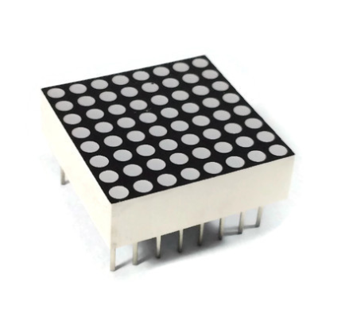

## Project 15: Beating Heart

**1.Project Introduction**

A dot-matrix display is an electronic digital display device that displays
information on machines, clocks and watches, public transport departure
indicators and many other devices.

In this project, we use a 8x8 LED dot matrix to make a beating heart.

**2.Project Hardware**

|  |   |  |  |
|-------------------------------------------------|--------------------------------------------------|-------------------------------------------------|-------------------------------------------------|
| Plus Board\*1                                   | Plus Board Holder                                | 400-Hole Breadboard                             | USB Cable\*1                                    |
|  |   |  |                                                 |
| 8\*8 Dot Matrix\*1                              | 220Ω Resistor\*8                                 | Jumper Wire\*10+                                |                                                 |

**3. Principle of 8\*8 dot-matrix**

The external view of a dot-matrix is shown as follows

The internal view of a dot-matrix is shown as follows

The 8\*8 dot-matrix is made up of sixty-four LEDs, and each LED is placed at the
cross point of a row and a column.

When the electrical level of a certain row is 1 and the electrical level of a
certain column is 0, the corresponding LED will lighten. If you want to light
the LED on the first dot, you should set pin 9 to high level and pin 13 to low
level.

If you want to light LEDs on the first row, you should set pin 9 to high level
and pins 13, 3, 4, 10, 6, 11, 15 and 16 to low level.

If you want to light the LEDs on the first column, set pin 13 to low level and
pins 9, 14, 8, 12, 1, 7, 2 and 5 to high level.

**4.Circuit Connection**

**5.Project Code**

/\*

keyestudio STEM Starter Kit

Project 15

Beating Heart

http//www.keyestudio.com

\*/

// 2-dimensional array of row pin numbers:

int R[] = {2,3,4,5,6,7,8,9};

// 2-dimensional array of column pin numbers:

int C[] = {10,11,12,13,14,15,16,17};

unsigned char biglove[8][8] = //the big "heart"

{

0,0,0,0,0,0,0,0,

0,1,1,0,0,1,1,0,

1,1,1,1,1,1,1,1,

1,1,1,1,1,1,1,1,

1,1,1,1,1,1,1,1,

0,1,1,1,1,1,1,0,

0,0,1,1,1,1,0,0,

0,0,0,1,1,0,0,0,

};

unsigned char smalllove[8][8] = //the small "heart"

{

0,0,0,0,0,0,0,0,

0,0,0,0,0,0,0,0,

0,0,1,0,0,1,0,0,

0,1,1,1,1,1,1,0,

0,1,1,1,1,1,1,0,

0,0,1,1,1,1,0,0,

0,0,0,1,1,0,0,0,

0,0,0,0,0,0,0,0,

};

void setup()

{

// iterate over the pins:

for(int i = 0;i\<8;i++)

// initialize the output pins:

{

pinMode(R[i],OUTPUT);

pinMode(C[i],OUTPUT);

}

}

void loop()

{

for(int i = 0 ; i \< 100 ; i++) //Loop display 100 times

{

Display(biglove); //Display the "Big Heart"

}

for(int i = 0 ; i \< 50 ; i++) //Loop display 50 times

{

Display(smalllove); //Display the "small Heart"

}

}

void Display(unsigned char dat[8][8])

{

for(int c = 0; c\<8;c++)

{

digitalWrite(C[c],LOW);//use thr column

//loop

for(int r = 0;r\<8;r++)

{

digitalWrite(R[r],dat[r][c]);

}

delay(1);

Clear(); //Remove empty display light

}

}

void Clear()

{

for(int i = 0;i\<8;i++)

{

digitalWrite(R[i],LOW);

digitalWrite(C[i],HIGH);

}

} //////////////////////////////////////////////////////////

**6.Project Result**

Upload the project code to the Plus development board，the 8\*8 dot matrix
screen shows a beating heart.

