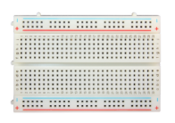

## Project 16: An Expressive Frog

**1.Project Introduction**

In this project, we will make a frog that can communicate with the outside world
and express its emotions in words. Here we use an LCD 1602 display controlled by
Arduino.

The ordinary 1602 LCD display needs to occupy 7 IO ports of the control board
when working. The 1602 LCD display we provide is equipped with IIC / I2C
interface, which will save you 5 IO ports of the control board.

KEYESTUDIO 1602 I2C module is a 16 character by 2 line LCD display with Blue
background and White backlight. It is very convenient to use with Arduino Liquid
Crystal Library and great for showing letters, numbers, and characters.

On the back of LCD display there is a blue potentiometer. You can turn the
potentiometer to adjust the contrast.

(Notice that when you rotate the potentiometer the screen will get brighter or
darker, the proper angle will make the font clearer).

**2.Project Hardware**

|  |   |  |  |
|-------------------------------------------------|--------------------------------------------------|-------------------------------------------------|-------------------------------------------------|
| Plus Development Board\*1                       | Plus Board Holder                                | 400-Hole Breadboard                             | USB Cable\*1                                    |
|  |   |  |                                                 |
| I2C 1602 LCD\*1                                 | Jumper Wire\*4                                   | Cartoon Frog Paper Card\*1                      |                                                 |

**3.I2C 1602 LCD Parameters**

-   Display capacity 16 \* 2 characters

-   Chip operating voltage 4.5 \~ 5.5V

-   Working current 2.0mA (5.0V)

-   Optimum working voltage of the module is 5.0V

-   Character size 2.95 \* 4.35 (W \* H) mm

-   I2C Address:0x27

-   Backlight (Blue with white char color)

**4.Connection**

GND: connect to ground

VCC: connect to +5V

SDA: connect to A4

SCL: connect to A5

**5.Project Code**

/\*

keyestudio STEM Starter Kit

Project 16

Frog Display Screen

http//www.keyestudio.com

\*/

\#include \<Wire.h\>

\#include \<LiquidCrystal_I2C.h\>

LiquidCrystal_I2C lcd(0x27,16,2); // set the LCD address to 0x27

void setup()

{

lcd.init(); // initialize the lcd

lcd.init();

lcd.backlight();

}

void loop()

{

lcd.setCursor(3,0);

lcd.print("Hello, world!");

lcd.setCursor(2,1);

lcd.print("keyestudio!");

}

//////////////////////////////////////////////////////////

**6.Project Result**

Upload the project code to the Plus development board. LCD1602 will display
“Hello, world!”on the first line, “keyestudio!” on the second line.

By changing the text in the brackets of the code we provided and uploading the
code again, you can control what the frog will say through the LCD display.

lcd.print("Hello, world!");

lcd.setCursor(2,1);

lcd.print("keyestudio!");

