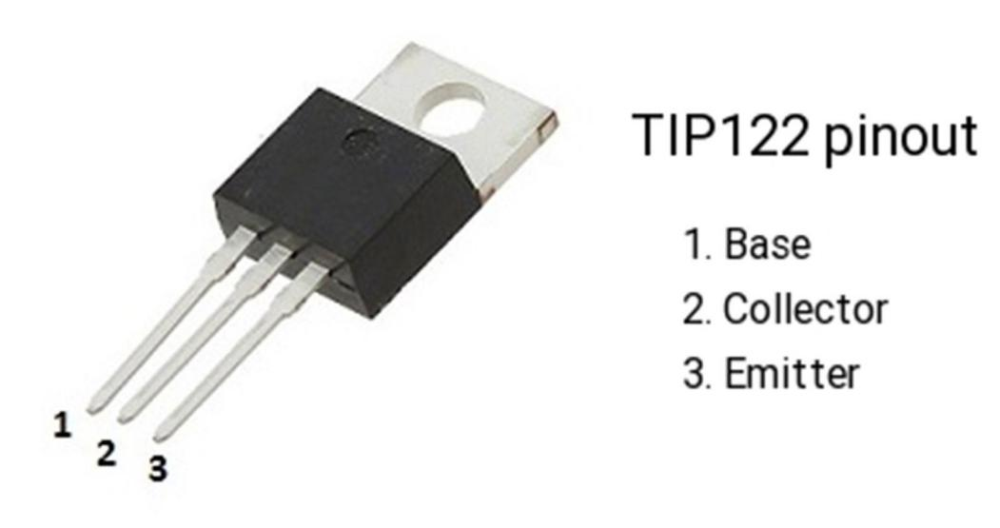

## Project 17: Small Fan

**1.Project Introduction**

Usually, the GPIO pins of Arduino can only provide a maximum current of 40 mA.
Since even a small 5V DC motor needs 50 mA or higher current to be driven, it is
not recommended to use the Arduino GPIO pins to drive the DC motor.

In this project, we will use a Plus Development Board, a TIP122 triode, a motor
and small fan leaf to make an electric fan.

**2.Project Hardware**

|  |    |  |  |
|-------------------------------------------------|---------------------------------------------------|-------------------------------------------------|-------------------------------------------------|
| Plus Development Board\*1                       | Plus Board Holder                                 | 400-Hole Breadboard                             | USB Cable\*1                                    |
|  |    |  |  |
| TIP122 Triode\*1                                | 1 KΩ Resistor \*1                                 | 9V Battery \*1                                  | 9V Battery holder \*1                           |
|  |    |  |                                                 |
| Fan Motor \*1                                   | Fan Leaf \*1                                      | Jumper Wire\*10+                                |                                                 |

**3.TIP122 Parameters:**

Voltage: Vceo: 100V;  
Power consumption, Pd: 65W;  
Collector DC current: 5A;  
DC current gain hFE: 1000;  
Package type: TO-220;  
Number of pins: 3;  
Total power, Ptot: 65W;  
Number of transistors: 1;  
Transistor type: Power Darlington;  
Maximum continuous current, Ic: 5A;  
Temperature: 25°C;  
Voltage, Vcbo: 100V;  
Current, Ic hFE: 3A;  
Current, Ic maximum: 5A;  
DC current gain hfe, minimum value: 1000;  
Surface mount devices: through-hole mounting;  
Collector current, average value of Ic: 5A;  
Saturation voltage, Vce sat maximum: 2V

**4.Connection Diagram**

**5.Project Code**

/\*

keyestudio Maker learning kit

Project 17

Small Fan

http//www.keyestudio.com

\*/

// the setup function runs once when you press reset or power the board

void setup() {

// initialize digital pin 3 as an output.

pinMode(3, OUTPUT);

}

// the loop function runs over and over again forever

void loop() {

digitalWrite(3, HIGH); // turn the motor on (HIGH is the voltage level)

delay(2000); // wait for 2 seconds

digitalWrite(3, LOW); // turn the motor off by making the voltage LOW

delay(3000); // wait for 3 second

}

//////////////////////////////////////////////////////////

**6.Project Result**

Upload the project code to the Plus development board.

Insert the fan blade into the motor shaft, you will get a small fan that rotates
for 2 seconds, and stops for 3 seconds, then restart.

