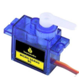

## Project 18: Car Speed Dial

**1.Project Introduction**

A servo motor is a type of motor that can rotate with great precision. It has
been widely used in many applications like toy car, RC helicopters and planes,
Robotics, etc.

In this project, we will use a servo motor and a paper card to DIY a car speed
dial.

1.  **Project Hardware**

|  |   |  |  |
|-------------------------------------------------|--------------------------------------------------|-------------------------------------------------|-------------------------------------------------|
| Plus Development Board\*1                       | Plus Board Holder                                | 400-Hole Breadboard                             | USB Cable\*1                                    |
|  |   |                                                 |                                                 |
| 9G Servo Motor\*1                               | Car Speed Dial Paper Card\*1                     |                                                 |                                                 |

**3. Working Principle of the Servo**

Servo is composed of a rudder disc, position feedback potentiometer, reduction
gear set, DC motor, and control circuit. A DC motor drives the reduction gear
set, and its output shaft drives a position feedback potentiometer with linear
proportional characteristics as position detection. According to the
potentiometer feedback voltage, the control circuit compares with the external
input control pulse, generates a correction pulse, controls and drives the DC
motor to rotate forward or reverse so that the output position of the reduction
gear is combined with the desired value. To achieve the purpose of accurately
controlling the steering angle.

The control pulse cycle of the servo is 20ms, and the pulse width ranges from
0.5ms to 2.5ms, corresponding to positions from -90 degrees to +90 degrees.

Let us take a 180-degree angle servo as an example

Servo motor comes with many specifications. But all of them have three
connection wires, distinguished by brown, red, orange (different brand may have
different color).

Brown one is for GND, red one for power positive, orange one for signal line.

**4.Connection Diagram**

**5.Project Code**

/\*

keyestudio STEM Starter Kit

Project 18

Car Speed Dial

http//www.keyestudio.com

\*/

\#include \<Servo.h\>

Servo myservo;// define servo variable name

void setup()

{

myservo.attach(9);// select servo pin(9 )

}

void loop()

{

myservo.write(0);// set rotate angle of the motor

delay(500);

myservo.write(45);// set rotate angle of the motor

delay(500);

myservo.write(90);// set rotate angle of the motor

delay(500);

myservo.write(135);// set rotate angle of the motor

delay(500);

myservo.write(180);// set rotate angle of the motor

delay(500);

}

//////////////////////////////////////////////////////////

**6.Project Result**

Put the card of the car speed dial to the servo and insert the plastic arm of
the servo into the its rotating shaft.

Upload the project code to the Plus development board.

The plastic arm of the servo will move at an angle of 0 degrees, 45 degrees, 90
degrees, 135 degrees, and 180 degrees.

A car speed dial model is completed.

\*\*\*\*\*\*\*\*\*\*\*\*\*\*\*\*\*\*\*\*\*\*\*\*\*\*\*\*\*\*next
project\*\*\*\*\*\*\*\*\*\*\*\*\*\*\*\*\*\*\*\*\*\*\*\*\*\*\*\*\*\*\*\*\*\*\*\*\*
