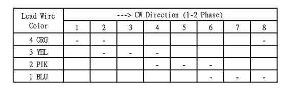
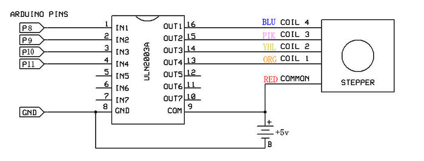

## Project 19: Clock Rotation

**1.Project Introduction**

Stepper motors can be positioned accurately and it is the most important part in
industrial robots, 3D printers, large lathes and other mechanical equipment.

In this project, we will use a stepper motor and a clock paper card to make a
clock model.

**2.Project Hardware**

|                                                                                                    |   |  |  |
|---------------------------------------------------------------------------------------------------------------------------------------------------|--------------------------------------------------|-------------------------------------------------|-------------------------------------------------|
| Plus Development Board\*1                                                                                                                         | Plus Board Holder                                | 400-Hole Breadboard                             | USB Cable\*1                                    |
|  |   |  |  |
| Stepper Motor\*1                                                                                                                                  | Stepper Motor driver\*1                          | Jumper Wire\*6                                  | Clock Paper Card\*1                             |

1.  **Stepper Motor and Driver**

Stepper Motor is a motor controlled by a series of electromagnetic coils. It can
turn an exact amount of degrees (or steps) as desired, allowing you to move it
to an exact location and hold that position. It does so by powering the coils
inside the motor for very short periods of time, but you have to power the motor
all the time to keep it in the position that you desire.

There are two basic types of stepper motors, unipolar steppers and bipolar
steppers.

In this lesson, we use a Unipolar Stepper Motor 28-BYJ48.

**Unipolar Stepper Motors**

A unipolar stepper motor has one winding with a center tap per phase. Each
section of windings is switched on for each direction of the magnetic field.
Since in this arrangement a magnetic pole can be reversed without switching the
direction of the current, the commutation circuit can be made very simple (e.g.,
a single transistor) for each winding. Typically, given a phase, the center tap
of each winding is made common: giving three leads per phase and six leads for a
typical two phase motor. Often, these two phase commons are internally joined,
so the motor has only five leads.

The simplest way of interfacing a unipolar stepper to Arduino is to use a
breakout for ULN2003A transistor array chip. The ULN2003A contains seven
darlington transistor drivers and is somewhat like having seven TIP120
transistors all in one package. The ULN2003A can pass up to 500 mA per channel
and has an internal voltage drop of about 1V when on. It also contains internal
clamp diodes to dissipate voltage spikes when driving inductive loads.To control
the stepper, apply voltage to each of the coils in a specific sequence.

Here are schematics showing how to interface a unipolar stepper motor to four
controller pins using a ULN2003A, and showing how to interface using four
TIP120’s.

**4.Circuit Connection**

**5.Project Code**

/\*

keyestudio STEM Starter Kit

Project 19

Analog clock rotation

http//www.keyestudio.com

\*/

// Stepper motor pin numbers

const int IN1_pin = 8;

const int IN2_pin = 9;

const int IN3_pin = 10;

const int IN4_pin = 11;

int val;

void setup() {

Serial.begin(9600);

// Arduino pin setup for stepper motor

pinMode(IN1_pin,OUTPUT);

pinMode(IN2_pin,OUTPUT);

pinMode(IN3_pin,OUTPUT);

pinMode(IN4_pin,OUTPUT);

}

void loop() {

int a = 1024;

int b = 1024;

val=Serial.read();

if(val=='A')

{

while(a--)

{

digitalWrite(IN1_pin, HIGH);

digitalWrite(IN2_pin, LOW);

digitalWrite(IN3_pin, LOW);

digitalWrite(IN4_pin, LOW);

delay(10);

digitalWrite(IN1_pin, LOW);

digitalWrite(IN2_pin, HIGH);

digitalWrite(IN3_pin, LOW);

digitalWrite(IN4_pin, LOW);

delay(10);

digitalWrite(IN1_pin, LOW);

digitalWrite(IN2_pin, LOW);

digitalWrite(IN3_pin, HIGH);

digitalWrite(IN4_pin, LOW);

delay(10);

digitalWrite(IN1_pin, LOW);

digitalWrite(IN2_pin, LOW);

digitalWrite(IN3_pin, LOW);

digitalWrite(IN4_pin, HIGH);

delay(10);

}

}

if(val=='C')

{

while(b--)

{

digitalWrite(IN4_pin, HIGH);

digitalWrite(IN3_pin, LOW);

digitalWrite(IN2_pin, LOW);

digitalWrite(IN1_pin, LOW);

delay(10);

digitalWrite(IN4_pin, LOW);

digitalWrite(IN3_pin, HIGH);

digitalWrite(IN2_pin, LOW);

digitalWrite(IN1_pin, LOW);

delay(10);

digitalWrite(IN4_pin, LOW);

digitalWrite(IN3_pin, LOW);

digitalWrite(IN2_pin, HIGH);

digitalWrite(IN1_pin, LOW);

delay(10);

digitalWrite(IN4_pin, LOW);

digitalWrite(IN3_pin, LOW);

digitalWrite(IN2_pin, LOW);

digitalWrite(IN1_pin, HIGH);

delay(10);

}

}

digitalWrite(IN4_pin, LOW);

digitalWrite(IN3_pin, LOW);

digitalWrite(IN2_pin, LOW);

digitalWrite(IN1_pin, LOW);

}

//////////////////////////////////////////////////////////

**6.Project Result**

Upload the code to the PLUS development board. Open the serial monitor and set
the baud rate to 9600, we input A in the serial monitor, the stepper motor is
forwarding, and input C in the serial monitor, the stepper motor is reversed.

\*\*\*\*\*\*\*\*\*\*\*\*\*\*\*\*\*\*\*\*\*\*\*\*\*\*\*\*\*next
project\*\*\*\*\*\*\*\*\*\*\*\*\*\*\*\*\*\*\*\*\*\*\*\*\*\*\*\*\*\*\*\*\*\*\*\*\*
