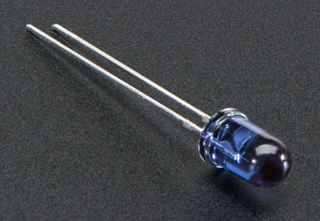

## Project 2: Blinking Eyes Of Dinosaur

****

1.  **Project Introduction**

In this project, we will show you a dinosaur with a blinking eye.

We use the digital pin of Arduino to turn on an LED and let it blink, match with
a cartoon dinosaur card we provided, the LDE will become the dinosaur's
twinkling eye.

1.  **Project Hardware**

|  |  |  |  |
|-------------------------------------------------|-------------------------------------------------|-------------------------------------------------|-------------------------------------------------|
| Plus Board\*1                                   | Plus Board holder                               | 400-hole Breadboard                             | USB cable\*1                                    |
|  |  |  |  |
| Red M5 LED\*1                                   | 220Ω Resistor\*1                                | Jumper Wire\*2                                  | Cartoon dinosaur Card\*1                        |

**Introduction Of Electronic Components**

**1.LED**:

LED is a type of semiconductor called "Light Emitting Diode" which is an
electronic device made of semiconductor materials (silicon, selenium, germanium,
etc). It has positive and negative poles. The short leg is the negative pole to
connect GND, and the long one is the positive pole to connect 5V.

**2.** **Five Band Resistor**

A resistor is an electronic component in the circuit, which limits and regulates
the current flow. Its unit is (Ω).

\-Band 1 – First significant digit.

\-Band 2 – Second significant digit.

\-Band 3 – Third significant digit.

\-Band 4 – Multiplier.

\-Band 5 – Tolerance.

In this kit, we provide three five-band resistors with different resistance
values.

1.  220Ω Resistor\*10

1.  10KΩ Resistor\*10

1.  1KΩ Resistor\*10

**3.** **Breadboard:**

The breadboard is used to build and test circuits quickly before finalizing any
circuit design. The breadboard has many holes which circuit components like ICs
and resistors can be inserted into.

A typical breadboard is shown below:

The bread board has strips of metal which run underneath the board and connect
the holes on the top of the board.

The metal strips are laid out as shown below. Note that the top and bottom rows
of holes are connected horizontally while the remaining holes are connected
vertically.

The first two rows (top) and last two rows (bottom) of the breadboard are used
for positive and for negative.

The conductive layout diagram of the breadboard is shown in the figure above.

The electronics beginners may get confused while connecting the DIP (Dual
In-line Packages) components such as integrated circuits, microcontrollers,
chips, etc.,. The rails are isolated by ravine or crevasse, thus the rows are
not connected to each other on either side. So, the DIP components can be
connected as shown in the figure below.

**3.Circuit Connection**

Look at the circuit schematic and wiring diagram of the project. Here we use
digital pin 10 and connect an LED to a 220 ohm resistor to avoid high current
damaging the LED. 

**circuit schematic**

**wiring diagram**

**NOTE:**

How to connect an LED

How to identify 5 band 220Ω Resistor

**4.Project Code**

/\*

keyestudio STEM Starter Kit

Project 2

Dinosaur Blink Eyes

http//www.keyestudio.com

\*/

int ledPin = 10; // define digital pin 10.

void setup()

{

pinMode(ledPin, OUTPUT);// define led pin as output.

}

void loop()

{

digitalWrite(ledPin, HIGH); // set the LED on.

delay(1000); // wait for a second.

digitalWrite(ledPin, LOW); // set the LED off.

delay(1000); // wait for a second

}

//////////////////////////////////////////////////////////////////

1.Open up the Arduino IDE and copy the below code into a new sketch.

2.Select the correct Board type and COM port for the Arduino IDE.

3.Click Upload button on Arduino IDE to upload code.

**6.Project Result**

Done uploading. The LED light connected to the D10 pin of the development board
turns on and off every second.

Put the dinosaur card on the LED bulb like the picture below, and you will get a
cute little dinosaur that can continue to blink its eye.

