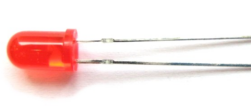

## Project 20: Dimmable Table Lamp

**1.Project Introduction**

A potentiometer is a three-terminal resistor with a sliding or rotating contact
that forms an adjustable voltage divider. It work by varying the position of a
sliding contact across a uniform resistance. In a potentiometer, the entire
input voltage is applied across the whole length of the resistor, and the output
voltage is the voltage drop between the fixed and sliding contact.

In this project, we are going to learn how to use Arduino to read the value of
the potentiometer, and make a dimmable table lamp.

1.  **Project Hardware**

|  |   |  |  |
|-------------------------------------------------|--------------------------------------------------|-------------------------------------------------|-------------------------------------------------|
| Plus Development Board\*1                       | Plus Board Holder                                | 400-Hole Breadboard                             | USB Cable\*1                                    |
|  |   |  |  |
| Potentiometer \*1                               | Red M5 LED \*1                                   | 220Ω Resistor\*1                                | Jumper Wire\*6                                  |
|  |                                                  |                                                 |                                                 |
| Table Lamp Paper Card\*1                        |                                                  |                                                 |                                                 |

**3.Potentiometer Features**

Adjustable potentiometer is a kind of resistor and an analog electronic
component, which has two states of 0 and 1(high level and low level). The analog
quantity is different, its data state presents a linear state such as 1 to 1000.

**4.Read Potentiometer Value**

We connect the Adjustable potentiometer to the analog pin of Arduino to read its
value. Please refer to the following wiring diagram for wiring.

/\*

keyestudio STEM Starter Kit

Project 20.1

Read Potentiometer Value

http//www.keyestudio.com

\*/

int potpin=A1;// initialize analog pin A1

int val=0;// define val, assign initial value 0

void setup()

{

Serial.begin(9600);// set baud rate at 9600

}

void loop()

{

val=analogRead(potpin);// read the analog value of analog pin 1, and assign it
to val

Serial.println(val);// display val’s value

}

//////////////////////////////////////////////////////////////////

When you rotate the potentiometer knob, you can see the displayed value change.
The reading of analog value is a very common function since most sensors output
analog value. After calculation, you can get the corresponding value you need.

Below figure shows the analog value it reads.

**5.Dimming Table Lamp Circuit Connection**

In the last step, we read the value of the potentiometer, and now we need to
convert the value of the potentiometer into the brightness of the LED to make a
small desk lamp with adjustable brightness. See the wiring diagram.

**6.Project Code**

/\*

keyestudio STEM Starter Kit

Project 20.2

Dimming Table Lamp

http//www.keyestudio.com

\*/

int potpin=A1;// initialize analog pin A1

int ledpin=11;// initialize digital pin 11

int val=0;// define val, assign initial value 0

void setup()

{

pinMode(ledpin,OUTPUT);// set digital pin as “output”

Serial.begin(9600);// set baud rate at 9600

}

void loop()

{

val=analogRead(potpin);// read the analog value of analog pin 1, and assign it
to val

analogWrite(ledpin,val/4);

Serial.println(val);// display val’s value

}

//////////////////////////////////////////////////////////////////

**7.Project Result**

Put the lamp paper card on the potentiometer and the led.

Upload the code to the PLUS development board.

Open the serial monitor, set the baud rate to 9600, and the monitor will display
the value of potentiometer.

When we turn the potentiometer, the brightness of the LED will change.

A model of a small desk lamp equipped with an adjustable brightness switch is
completed. 
