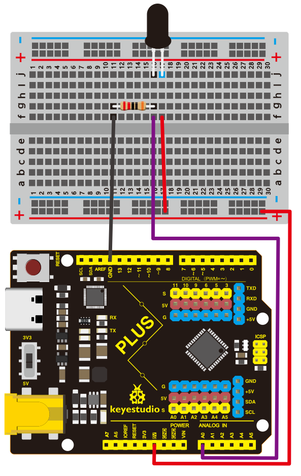
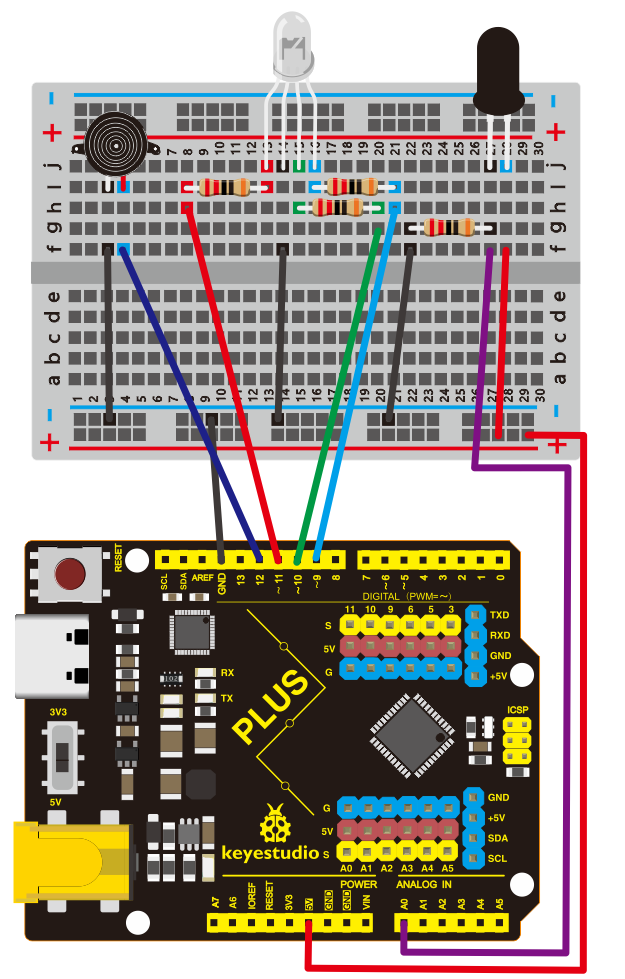
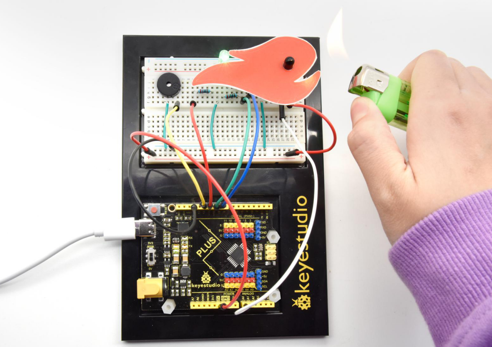

## Project 21: Flame Alarm

**1.Project Introduction**

Fire is one of the terrible disasters, and Fire Alarm Systems are very useful in
houses, commercial building, and factories

In this project, we will use the flame sensor and buzzer to make a fire alarm
device. This is a meaningful maker activity.

**2.Project Hardware**

|  |                            |  |  |
|-------------------------------------------------|---------------------------------------------------------------------------|-------------------------------------------------|-------------------------------------------------|
| Plus Development Board\*1                       | Plus Board Holder                                                         | 400-Hole Breadboard                             | USB Cable\*1                                    |
|  |    |  |  |
| Flame Sensor \*1                                | Buzzer \*1                                                                | 10KΩ Resistor\*1                                | Jumper Wire\*7                                  |
|  |                                                                           |                                                 |                                                 |
| Fire Alarm Paper Card\*1                        |                                                                           |                                                 |                                                 |

**3.Little Knowledge**

The flame will emit some level of IR light, this light is not visible to human
eyes but our flame sensor can detect it and alert a microcontroller like Arduino
that a fire has been detected. It has an infrared receiving tube specially
designed to detect fire, and then to convert the flame brightness into
fluctuating level signal.

The shorter lead of the receiving triode is negative, the other one is positive.
We should connect negative to 5V pin, connect positive to an analog pin, a
resistor, and GND. As shown below

**4.Read Flame Sensor Value**

We first use a simple code to read the value of the flame sensor, print it in
the serial monitor.

**Project code**

/\*

keyestudio STEM Starter Kit

Project 21.1

Read Flame Sensor Value

http//www.keyestudio.com

\*/

int flamepin=0;// initialize analog pin 0

int val=0;// define val, assign initial value 0

void setup()

{

Serial.begin(9600);// set baud rate at 9600

}

void loop()

{

val=analogRead(flamepin);// read the analog value of analog pin 0, and assign it
to val

Serial.println(val);// display val’s value

}

//////////////////////////////////////////////////////////////////

Upload the code to the Plus development board, open the serial monitor, and use
a lighter to approach the flame sensor to see the value.

**5.Flame Alarm Circuit Connection**

Next, we will use the flame sensor and buzzer RGB LED to make a fun project---
flame alarm. When flame is detected, the RGB will light up and the buzzer will
alarm.

**6.Project Code**

/\*

keyestudio STEM Starter Kit

Project 21.2

Flame Alarm

http//www.keyestudio.com

\*/

const int red = 11;

const int green = 10;

const int blue= 9;

const int buzzer = 12;

const int flamepin = A0;

const int thereshold = 1;

void setup() {

// put your setup code here, to run once:

Serial.begin(9600);

pinMode(red, OUTPUT);

pinMode(green, OUTPUT);

pinMode(blue, OUTPUT);

pinMode(buzzer, OUTPUT);

pinMode(flamepin, INPUT);

}

void setColor(int redValue, int greenValue, int blueValue)

{

analogWrite(red, redValue);

analogWrite(blue, blueValue);

analogWrite(green, greenValue);

}

void loop() {

// put your main code here, to run repeatedly:

int flamesenseval = analogRead(flamepin);

Serial.print(flamesenseval);

if (flamesenseval \>= thereshold) {

setColor(255, 0, 0); // Red Color

tone(buzzer, 1000);

delay(10);

}

else

{

setColor(0, 255, 0); // Green Color

noTone(buzzer);

}

}

//////////////////////////////////////////////////////////////////

**7.Project Result**

Upload the code to the PLUS development board.

Open the serial monitor, set the baud rate to 9600, and the monitor will display
the value of the flame sensor.

We use a lighter close to the flame sensor, the RGB LED will emit different
colors, and the buzzer will alarm.

\*\*\*\*\*\*\*\*\*\*\*\*\*\*\*\*\*\*\*\*\*\*\*\*\*\*\*\*\*\*next
project\*\*\*\*\*\*\*\*\*\*\*\*\*\*\*\*\*\*\*\*\*\*\*\*\*\*\*\*\*\*\*\*\*\*\*\*\*
