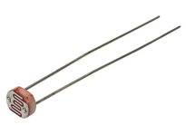

## Project 22: Light Lamp

**1.Project Introduction**

A photocell is a resistor that changes resistance depending on the amount of
light incident on it. A photocell operates on semiconductor photoconductivity:
the energy of photons hitting the semiconductor frees electrons to flow,
decreasing the resistance.

We use the characteristics of Photocell to make a light-controlled table lamp.

**Project Hardware**

|  |    |  |  |
|-------------------------------------------------|---------------------------------------------------|-------------------------------------------------|-------------------------------------------------|
| Plus Development Board\*1                       | Plus Board Holder                                 | 400-Hole Breadboard                             | USB Cable\*1                                    |
|  |    |  |  |
| Photocell \*1                                   | Red M5 LED \*1                                    | 220Ω Resistor\*1                                | 10KΩ Resistor\*1                                |
|  |    |                                                 |                                                 |
| Jumper Wire\*6                                  | Light Lamp Paper Card\*1                          |                                                 |                                                 |

1.  **Photocell Little Knowledge**

Photocell is commonly applied in the measurement of light, light control and
photovoltaic conversion (convert the change of light into the change of
electricity).

Photocell is also being widely applied to various light control circuit, such as
light control and adjustment, optical switches, etc.

We will start with a relatively simple experiment regarding to photovaristor
application.

**4.Read Photocell Value**

We first use a simple code to read the value of the photocell, print it in the
serial monitor

/\*

keyestudio STEM Starter Kit

Project 22.1

Read Photocell value

http//www.keyestudio.com

\*/

int photocellpin=0;// initialize analog pin 0, connected with photocell

int val=0;// initialize variable va

void setup()

{

Serial.begin(9600);// set baud rate at “9600”

}

void loop()

{

val=analogRead(photocellpin);// read the value of the sensor and assign it to
val

Serial.println(val);// display the value of val

delay(1000);// wait for 1 s

}

//////////////////////////////////////////////////////////////////

Upload the code to the Plus development board, open the serial monitor, and then
you can read the value of photocell. We put our hands on the photocell, and you
will find that the value displayed on the serial monitor becomes greater.

**5.Light Lamp Circuit Connection**

We made a small dimming table lamp, and now we are apt to make a
light-controlled table lamp. Their principles of them are same. That is getting
the analog value of the sensor through Arduino and then adjusting the brightness
of the LED.

**6.Project Code**

/\*

keyestudio STEM Starter Kit

Project 22.2

Light Lamp

http//www.keyestudio.com

\*/

int photocellpin=0;// initialize analog pin 0, connected with photocell

int ledpin=11;// initialize digital pin 11,

int val=0;// initialize variable va

void setup()

{

pinMode(ledpin,OUTPUT);// set digital pin 11 as “output”

Serial.begin(9600);// set baud rate at “9600”

}

void loop()

{

val=analogRead(photocellpin);// read the value of the sensor and assign it to
val

Serial.println(val);// display the value of val

analogWrite(ledpin,val/4);// set up brightness（maximum value 255）

delay(10);// wait for 0.01s

}

//////////////////////////////////////////////////////////////////

**7.Project Result**

Hook up the components as follows.

Upload the code to the PLUS development board.

Open the serial monitor and set the baud rate to 9600. The monitor will display
the current photocell value.

When we put our hands on the photocell, the value displayed on the serial
monitor will become larger and LED will dim. When we release our finger, the
displayed value will become smaller and the LED will become brighter.

\*\*\*\*\*\*\*\*\*\*\*\*\*\*\*\*\*\*\*\*\*\*\*\*\*\*\*\*\*\*\*\*\*next
project\*\*\*\*\*\*\*\*\*\*\*\*\*\*\*\*\*\*\*\*\*\*\*\*\*\*\*\*\*\*\*\*\*\*\*\*\*
