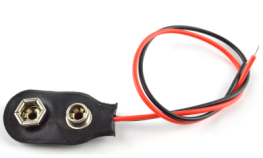

## Project 23: Smart Fan

**1.Project Introduction**

The sound sensor has a built-in capacitive electret microphone and power
amplifier. It can be used to detect the sound intensity of the environment.

In this project, we use a sound sensor and a DC motor to make a voice-activated
smart fan.

**2.Project Hardware**

|  |   |  |  |
|-------------------------------------------------|--------------------------------------------------|-------------------------------------------------|-------------------------------------------------|
| Plus Development Board\*1                       | Plus Board Holder                                | 400-Hole Breadboard                             | USB Cable\*1                                    |
|  |   |  |  |
| Sound sensor \*1                                | TIP122 Triode\*1                                 | 1 KΩ Resistor \*1                               | 9V Battery \*1                                  |
|  |   |  |  |
| 9V Battery holder \*1                           | Fan Motor \*1                                    | Fan Leaf \*1                                    | Jumper Wire\*10+                                |
|  |                                                  |                                                 |                                                 |
| Mic Paper Card\*1                               |                                                  |                                                 |                                                 |

**3.Sound Sensor Little Knowledge**

Sound sensor is typically used in detecting the loudness in ambient environment.
The Arduino can collect its output signal by analog input interface.   
The S pin is analog output that is voltage signal real-time output of
microphone. The sensor comes with a potentiometer, so that you can adjust the
signal gain.  
It also has a fixed hole to mount the sensor on any other devices. You can use
it to make some interactive works, such as a voice operated switch.

1.  **Read Sound Sensor Value**

We first use a simple code to read the value of the sound sensor, print it in
the serial monitor, and wire up.

/\*

keyestudio STEM Starter Kit

Project 23.1

Read Sound Sensor Value

http//www.keyestudio.com

\*/

int soundpin=0;// initialize analog pin 0, connected with sound sensor

int val=0;// initialize variable va

void setup()

{

Serial.begin(9600);// set baud rate at “9600”

}

void loop()

{

val=analogRead(soundpin);// read the value of the sensor and assign it to val

Serial.println(val);// display the value of val

delay(1000);// wait for 1 s

}

//////////////////////////////////////////////////////////////////

Upload the code to the Plus development board, open the serial monitor, blow or
clap your hands at the sensor, you can see the sensor's value changes
significantly.

1.  **Smart Fan Connection Diagram**

Next, we formally enter this project. We use a sound sensor and a small motor to
make a sound-activated fan. Connect to the circuit diagram below.

**6.Project Code**

/\*

keyestudio STEM Starter Kit

Project 23.2

Smart Fan

http//www.keyestudio.com

\*/

int motorpin = 3; // set pin for motor

void setup() {

Serial.begin(9600);

pinMode(motorpin,OUTPUT);

}

void loop() {

int Soundvalue = analogRead(A0); // read the input analog value

Serial.println(Soundvalue);

if(Soundvalue\>700)

{

digitalWrite(motorpin,HIGH); // when the analog value is bigger than the set
value, turn on the motor

for(int i=0;i\<5;i++){

delay(1000); // wait for 5s

}

}

else{

digitalWrite(motorpin,LOW); // turn off the motor

}

}

//////////////////////////////////////////////////////////

**7.Project Result**

Upload the code to the PLUS development board. After success, open the serial
monitor, set the baud rate to 9600, and the monitor displays the value of the
sound.

We blow to the sound sensor. When the sound is louder, the value displayed on
the serial monitor is larger. When the value is greater than 700, the fan starts
to work.

\*\*\*\*\*\*\*\*\*\*\*\*\*\*\*\*\*\*\*\*\*\*\*\*\*\*\*\*\*\*\*\*next
project\*\*\*\*\*\*\*\*\*\*\*\*\*\*\*\*\*\*\*\*\*\*\*\*\*\*\*\*\*\*\*\*\*\*\*\*\*
