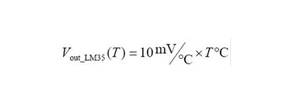

## Project 24: Temperature Tester

**1.Project Introduction**

LM35 is a common and easy-to-use temperature sensor. It does not require other
hardware. You just need an analog port to make it work. The difficulty lies in
compiling the code to convert the analog value it reads into Celsius
temperature.

In this project, we use a temperature sensor and 3 LED lights to make a
temperature tester. When the temperature sensor touches different temperature
objects, the LED lights will show different colors.

**2.Project Hardware**

|  |    |  |  |
|-------------------------------------------------|---------------------------------------------------|-------------------------------------------------|-------------------------------------------------|
| Plus Development Board\*1                       | Plus Board Holder                                 | 400-Hole Breadboard                             | USB Cable\*1                                    |
|  |    |  |  |
| LM35 sensor\*1                                  | Red M5 LED \*3                                    | 220Ω Resistor\*1                                | Jumper Wire\*10+                                |
|  |                                                   |                                                 |                                                 |
| Temperature tester Paper Card\*1                |                                                   |                                                 |                                                 |

**3. Temperature Sensor Working Principle**

LM35 is a widely used temperature sensor with many different package types. At
room temperature, it can achieve the accuracy of ±1/4°C without additional
calibration processing.

LM35 temperature sensor can produce different voltage by different temperature

When temperature is 0 ℃, it outputs 0V; if increasing 1 ℃, the output voltage
will increase 10 mv.

The output temperature is 0℃～100℃, the conversion formula is as follows:

**4.Read Temperature Value**

We first use a simple code to read the value of the temperature sensor, print it
in the serial monitor, and wire it as shown below.

Here, LM35 output is given to analog pin A0 of Plus board. This analog voltage
is converted to its digital form and processed to get the temperature reading.

/\*

keyestudio STEM Starter Kit

Project 24.1

Read temperature value

http//www.keyestudio.com

\*/

\#define sensorPin A0

void setup()

{

Serial.begin(9600);

}

void loop()

{

int reading = analogRead(sensorPin);

float voltage = reading \* 5.0;

voltage /= 1024.0;

float temperatureC = (500 \* reading) /1024 ;

float temperatureF = (temperatureC \* 9.0 / 5.0) + 32.0;

Serial.print(voltage); Serial.print(" volts - ");

Serial.print(temperatureC); Serial.print(" degrees C - ");

Serial.print(temperatureF); Serial.println(" degrees F");

delay(1000);

}

//////////////////////////////////////////////////////////////////

Upload the code to the Plus development board, open the serial monitor, and then
you can read the current temperature value.

**5.Temperature Tester Circuit Connection**

Now use the LM35 temperature sensor and 3 LEDs to do a temperature tester. When
the temperature tester senses different temperatures, different LEDs will light
up. Follow the diagram below for wiring.

**6.Project Code**

/\*

keyestudio STEM Starter Kit

Project 24.2

Temperature tester

http//www.keyestudio.com

\*/

\#define sensorPin A0

\#define greenLED 8

\#define yellowLED 9

\#define redLED 10

void setup()

{

pinMode(greenLED, OUTPUT);

pinMode(yellowLED, OUTPUT);

pinMode(redLED, OUTPUT);

Serial.begin(9600);

}

void loop()

{

int reading = analogRead(sensorPin);

float voltage = reading \* 5.0;

voltage /= 1024.0;

float temperatureC = (500 \* reading) /1024 ;

float temperatureF = (temperatureC \* 9.0 / 5.0) + 32.0;

Serial.print(voltage); Serial.print(" volts - ");

Serial.print(temperatureC); Serial.print(" degrees C - ");

Serial.print(temperatureF); Serial.println(" degrees F");

if (temperatureF \>= 75) {

digitalWrite(greenLED, LOW);

digitalWrite(yellowLED, LOW);

digitalWrite(redLED, HIGH);

}

else if (temperatureF \>= 70 && temperatureF \< 75) {

digitalWrite(greenLED, LOW);

digitalWrite(yellowLED, HIGH);

digitalWrite(redLED, LOW);

}

else {

digitalWrite(greenLED, HIGH);

digitalWrite(yellowLED, LOW);

digitalWrite(redLED, LOW);

}

delay(3000);

}

//////////////////////////////////////////////////////////////////

**7.Project Result**

Upload the code to the PLUS development board, open the serial monitor and set
the baud rate to 9600. The monitor displays the current temperature value.

We wire up components as below. When temperature sensor works, LED will light
up. 

\*\*\*\*\*\*\*\*\*\*\*\*\*\*\*\*\*\*\*\*\*\*\*\*\*\*\*\*\*\*\*next
project\*\*\*\*\*\*\*\*\*\*\*\*\*\*\*\*\*\*\*\*\*\*\*\*\*\*\*\*\*\*\*\*\*\*\*\*\*
