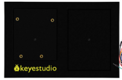
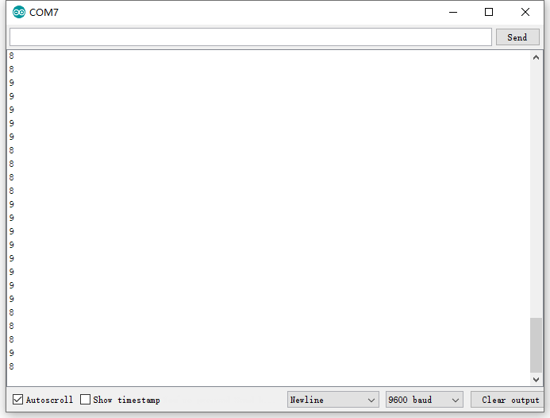

## Project 25: Batman Is Coming

****

**1.Project Introduction  
**HC-SR04 Ultrasonic Sensor is a very affordable distance sensor that is mainly
used for object avoidance in various robotics projects.

It has also been used in water level sensing, and even as a parking sensor.

We use the ultrasonic sensor as the eyes of a bat. In the dark, the bat can
still recognize the object and direction in front of it through ultrasound.

**2.Project Hardware**

|  |    |  |  |
|-------------------------------------------------|---------------------------------------------------|-------------------------------------------------|-------------------------------------------------|
| Plus Development Board\*1                       | Plus Board Holder                                 | 400-Hole Breadboard                             | USB Cable\*1                                    |
|  |    |  |  |
| Ultrasonic Sensor\*1                            | Red M5 LED \*3                                    | 220Ω Resistor\*1                                | Jumper Wire\*4                                  |
|  |                                                   |                                                 |                                                 |
| Cartoon Bat Paper Card\*1                       |                                                   |                                                 |                                                 |

1.  **Specification**

The HC-SR04 ultrasonic sensor uses sonar to determine distance to an object like
bats do. It offers excellent non-contact range detection with high accuracy and
stable readings in an easy-to-use package. It operation is not affected by
sunlight or black material like sharp rangefinders are (although acoustically
soft materials like cloth can be difficult to detect). It comes with ultrasonic
transmitter and receiver module.

On the front of the ultrasonic range finder are two metal cylinders. These are
transducers. Transducers convert mechanical forces into electrical signals. In
the ultrasonic range finder, there is a transmitting transducer and receiving
transducer. The transmitting transducer converts an electrical signal into the
ultrasonic pulse, and the receiving transducer converts the reflected ultrasonic
pulse back into an electrical signal. If you look at the back of the range
finder, you will see an IC behind the transmitting transducer labelled MAX3232.
This is the IC that controls the transmitting transducer. Behind the receiving
transducer is an IC labelled LM324. This is a quad Op-Amp that amplifies the
signal generated by the receiving transducer into a signal that’s strong enough
to transmit to the Arduino.

**TIMING DIAGRAM**

The timing diagram of HC-SR04 is shown. To start measurement, Trig of SR04 must
receive a pulse of high (5V) for at least 10us, this will initiate the sensor
will transmit out 8 cycle of ultrasonic burst at 40kHz and wait for the
reflected ultrasonic burst. When the sensor detected ultrasonic from receiver,
it will set the Echo pin to high (5V) and delay for a period (width) which
proportion to distance. To obtain the distance, measure the width (Ton) of Echo
pin.

Time = Width of Echo pulse, in us (micro second)

Distance in centimeters = Time / 58

Distance in inches = Time / 148

1.  **Read Ultrasonic Sensor Value**

We will start with a simple ultrasonic range finder that measures the output
distance to the serial monitor.

The HC-SR04 ultrasonic sensor has four pins: Vcc, Trig, Echo, and GND. The Vcc
pin supplies the power to generate the ultrasonic pulses. The GND pin is
connected to ground. The Trig pin is where the Arduino sends the signal to start
the ultrasonic pulse. The Echo pin is where the ultrasonic sensor sends the
information about the duration of the trip taken by the ultrasonic pulse to the
Plus board.

Build the circuit as below diagram:

/\*

keyestudio STEM Starter Kit

Project 25.1

Read Ultrasonic Sensor value

http//www.keyestudio.com

\*/

const int trig = 6;

const int echo = 5;

int duration = 0;

int distance = 0;

void setup()

{

pinMode(trig , OUTPUT);

pinMode(echo , INPUT);

Serial.begin(9600);

}

void loop()

{

digitalWrite(trig , HIGH);

delayMicroseconds(1000);

digitalWrite(trig , LOW);

duration = pulseIn(echo , HIGH);

distance = (duration/2) / 28.5 ;

Serial.println(distance);

}

After upload well the code to Plus board, then open the serial monitor.

When place an object in front of the ultrasonic sensor (from near and far), it
will detect the distance of object. The value will be displayed on the monitor.

**5.Circuit Connection**

Next, we will use the ultrasonic module and 4 LEDs to make a simple ultrasonic
rangefinder.Build the circuit as below digram:

**6.Project Code**

/\*

keyestudio STEM Starter Kit

Project 25.2

Batman Is Coming

http//www.keyestudio.com

\*/

const int trig = 6;

const int echo = 5;

const int LED1 = 11;

const int LED2 = 10;

const int LED3 = 9;

const int LED4 = 8;

int duration = 0;

int distance = 0;

void setup()

{

pinMode(trig , OUTPUT);

pinMode(echo , INPUT);

pinMode(LED1 , OUTPUT);

pinMode(LED2 , OUTPUT);

pinMode(LED3 , OUTPUT);

pinMode(LED4 , OUTPUT);

Serial.begin(9600);

}

void loop()

{

digitalWrite(trig , HIGH);

delayMicroseconds(1000);

digitalWrite(trig , LOW);

duration = pulseIn(echo , HIGH);

distance = (duration/2) / 28.5;

Serial.println(distance);

if ( distance \<= 7 )

{

digitalWrite(LED1, HIGH);

}

else

{

digitalWrite(LED1, LOW);

}

if ( distance \<= 14 )

{

digitalWrite(LED2, HIGH);

}

else

{

digitalWrite(LED2, LOW);

}

if ( distance \<= 21 )

{

digitalWrite(LED3, HIGH);

}

else

{

digitalWrite(LED3, LOW);

}

if ( distance \<= 28 )

{

digitalWrite(LED4, HIGH);

}

else

{

digitalWrite(LED4, LOW);

}

}

////////////////////////////////////////////////////////////////////////

**7.Project Result**

Upload the code to the PLUS development board. Hook up components as follows.
The ultrasonic module can detect the distance of the obstacle in front. Also, as
we cover the ultrasonic module by hand, the corresponding LED will light up.

\*\*\*\*\*\*\*\*\*\*\*\*\*\*\*\*\*\*\*\*\*\*\*\*\*\*\*\*\*\*\*next
project\*\*\*\*\*\*\*\*\*\*\*\*\*\*\*\*\*\*\*\*\*\*\*\*\*\*\*\*\*\*\*\*\*\*\*\*\*
