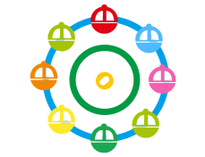
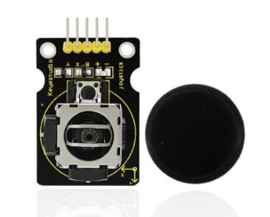

## Project 26: Spinning Ferris Wheel

**1.Project Introduction**

Joystick is a component with two analog inputs and one digital input. It is
widely used in game operation, robot control, drone control and other fields.

In this project, we use a joystick module and stepper motor to make a rotating
ferris wheel. You can have a deeper understanding of the principle and operation
of joystick in practice.

1.  **Project Hardware**

|                                                                                                    |    |             |  |
|---------------------------------------------------------------------------------------------------------------------------------------------------|---------------------------------------------------|------------------------------------------------------------|-------------------------------------------------|
| Plus Development Board\*1                                                                                                                         | Plus Board Holder                                 | 400-Hole Breadboard                                        | USB Cable\*1                                    |
|  |    |  |  |
| Stepper Motor\*1                                                                                                                                  | Stepper Motor driver\*1                           | Joystick Module\*1                                         | Jumper Wire\*10                                 |
|                                                                                                    |                                                   |                                                            |                                                 |
| Ferris Wheel Paper Card\*1                                                                                                                        |                                                   |                                                            |                                                 |

1.  **Joystick Module**

Joystick module has 5 pins: Vcc, Ground, X, Y, Key. The thumbstick provides
accurate readings. Additionally, you can press the joystick down to activate a
‘press to select’ push-button.

1.  **Read Joystick Module value**

We have to use analog Arduino pins to read the data from the X/Y pins, and a
digital pin to read the button.Please connect according to the wiring diagram
below.

/\*

keyestudio STEM Starter Kit

Project 26.1

Read Joystick Module Value

http//www.keyestudio.com

\*/

int VRx = A0;

int VRy = A1;

int SW = 3;

int xPosition = 0;

int yPosition = 0;

int SW_state = 0;

int mapX = 0;

int mapY = 0;

void setup() {

Serial.begin(9600);

pinMode(VRx, INPUT);

pinMode(VRy, INPUT);

pinMode(SW, INPUT_PULLUP);

}

void loop() {

xPosition = analogRead(VRx);

yPosition = analogRead(VRy);

SW_state = digitalRead(SW);

mapX = map(xPosition, 0, 1023, -512, 512);

mapY = map(yPosition, 0, 1023, -512, 512);

Serial.print("X: ");

Serial.print(mapX);

Serial.print(" \| Y: ");

Serial.print(mapY);

Serial.print(" \| Button: ");

Serial.println(SW_state);

delay(100);

}

////////////////////////////////////////////////////////////////////////////

Upload the code to Plus board. Then open the serial monitor and set the baud
rate to 9600. You can see its value on the serial monitor when you shake the
joystick, or press the button

1.  **Spinning ferris wheel Circuit Connection**

We have just read the value of the joystick, here we need to use the joystick
and stepper motor to do some things, connect according to the following figure.

**6.Project Code**

/\*

keyestudio STEM Starter Kit

Project 26.2

Spinning ferris wheel

http//www.keyestudio.com

\*/

const int X_pin = 0; // analog pin connected to X output

const int Y_pin = 1; // analog pin connected to Y output

int SW_pin = 3;

int X_Rotate;

int Y_Rotate;

// Stepper motor pin numbers

const int IN1_pin = 8;

const int IN2_pin = 9;

const int IN3_pin = 10;

const int IN4_pin = 11;

void setup() {

// Arduino pin setup for Joystick

pinMode(SW_pin, INPUT);

digitalWrite(SW_pin, HIGH);

// Arduino pin setup for stepper motor

pinMode(IN1_pin,OUTPUT);

pinMode(IN2_pin,OUTPUT);

pinMode(IN3_pin,OUTPUT);

pinMode(IN4_pin,OUTPUT);

}

void loop() {

X_Rotate = analogRead(X_pin);

Y_Rotate = analogRead(Y_pin);

if (Y_Rotate \< 500) {

digitalWrite(IN1_pin, HIGH);

digitalWrite(IN2_pin, LOW);

digitalWrite(IN3_pin, LOW);

digitalWrite(IN4_pin, LOW);

delay((Y_Rotate/2)+2);

digitalWrite(IN1_pin, LOW);

digitalWrite(IN2_pin, HIGH);

digitalWrite(IN3_pin, LOW);

digitalWrite(IN4_pin, LOW);

delay((Y_Rotate/2)+2);

digitalWrite(IN1_pin, LOW);

digitalWrite(IN2_pin, LOW);

digitalWrite(IN3_pin, HIGH);

digitalWrite(IN4_pin, LOW);

delay((Y_Rotate/2)+2);

digitalWrite(IN1_pin, LOW);

digitalWrite(IN2_pin, LOW);

digitalWrite(IN3_pin, LOW);

digitalWrite(IN4_pin, HIGH);

delay((Y_Rotate/2)+2);

}

else if (Y_Rotate \> 550){

digitalWrite(IN4_pin, HIGH);

digitalWrite(IN3_pin, LOW);

digitalWrite(IN2_pin, LOW);

digitalWrite(IN1_pin, LOW);

delay((1028-Y_Rotate)/2);

digitalWrite(IN4_pin, LOW);

digitalWrite(IN3_pin, HIGH);

digitalWrite(IN2_pin, LOW);

digitalWrite(IN1_pin, LOW);

delay((1028-Y_Rotate)/2);

digitalWrite(IN4_pin, LOW);

digitalWrite(IN3_pin, LOW);

digitalWrite(IN2_pin, HIGH);

digitalWrite(IN1_pin, LOW);

delay((1028-Y_Rotate)/2);

digitalWrite(IN4_pin, LOW);

digitalWrite(IN3_pin, LOW);

digitalWrite(IN2_pin, LOW);

digitalWrite(IN1_pin, HIGH);

delay((1028-Y_Rotate)/2);

}

else if (Y_Rotate \> 500 && Y_Rotate \< 550) {

digitalWrite(IN4_pin, LOW);

digitalWrite(IN3_pin, LOW);

digitalWrite(IN2_pin, LOW);

digitalWrite(IN1_pin, LOW);

}}

//////////////////////////////////////////////////////////

**7.Project Result**

Upload the project code to the Plus development board. Hook up the components as
follows. Push the joystick, the stepper motor will rotate, just like we are
playing on the Ferris wheel.

\*\*\*\*\*\*\*\*\*\*\*\*\*\*\*\*\*\*\*\*\*\*\*\*\*\*\*\*\*\*next
project\*\*\*\*\*\*\*\*\*\*\*\*\*\*\*\*\*\*\*\*\*\*\*\*\*\*\*\*\*\*\*\*\*\*\*\*\*
