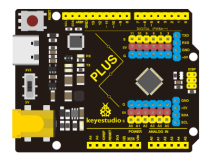
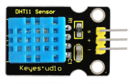

## Project 27: Temperature Humidity Meters

**1.Project Introduction**

DHT11 Temperature and Humidity Sensor features calibrated digital signal output
with the temperature and humidity sensor complex. Its technology ensures high
reliability and excellent long-term stability. A high-performance 8-bit
microcontroller is connected.

This sensor includes a resistive element and a sense of wet NTC temperature
measuring devices. It has the advantages of excellent quality, fast response,
anti-interference ability and high cost performance.

We use DHT11 Temperature and Humidity Sensor to make a temperature humidity
meters. The shape of this project is a cloud. Of course, we have to combine the
1602 screen to display the temperature and humidity values.

**2.Project Hardware**

|  |   |  |  |
|-------------------------------------------------|--------------------------------------------------|-------------------------------------------------|-------------------------------------------------|
| Plus Development Board\*1                       | Plus Board Holder                                | 400-Hole Breadboard                             | USB Cable\*1                                    |
|  |   |  |  |
| I2C 1602 LCD\*1                                 | DHT11 Sensor\*1                                  | Jumper Wire\*7                                  | Cartoon Cloud Paper Card\*1                     |

**3.DHT11 Specification**

The DHT11 humidity and temperature sensor makes it really easy to add humidity
and temperature data to your DIY electronics projects. It’s perfect for remote
weather stations, home environmental control systems, and farm or garden
monitoring systems.

-   Supply Voltage +5 V

-   Temperature Range 0-50 °C error of ± 2 °C

-   Humidity 20-90% RH ± 5% RH error

-   Interface digital

**4.Read Temperature and Humidity Value**

Firstly we learn how to use serial monitor to print the value of the DHT11
sensor. Follow the wiring diagram below.

Please download the
[DHT11Lib](https://github.com/RobTillaart/Arduino/tree/master/libraries/DHTlib)
firstly. Or [see the website](http://playground.arduino.cc/Main/DHTLib)

/\*

keyestudio STEM Starter Kit

Project 27.1

Read Temperature And Humidity Value

http//www.keyestudio.com

\*/

\#include \<dht11.h\>

dht11 DHT11;

\#define DHT11PIN 11

void setup()

{

Serial.begin(9600);

}

void loop()

{

Serial.println("\\n");

int chk = DHT11.read(DHT11PIN);

Serial.println("keyestudio DHT11 ");

Serial.print("Humidity (%): ");

Serial.println((float)DHT11.humidity, 2);

Serial.print("Temperature (oC): ");

Serial.println((float)DHT11.temperature, 2);

delay(2000);

}

Upload the code to Plus board.Then open the serial monitor and set the baud rate
to 9600, you will see the current temperature and humidity value.

**5.Temperature Humidity Meters Circuit Connection**

Now we start to use LCD screen to print the value of DHT11 sensor, we will see
the value on the LCD screen. so let’s start the project. Connect according to
the connection diagram below.

**6.Project Code**

/\*

keyestudio STEM Starter Kit

Project 27.2

Temperature Humidity Meters

http//www.keyestudio.com

\*/

\#include \<dht11.h\>

dht11 DHT11;

\#define DHT11PIN 11

\#include \<Wire.h\>

\#include \<LiquidCrystal_I2C.h\>

LiquidCrystal_I2C lcd(0x27,16,2); // set the LCD address to 0x27 for a 16 chars
and 2 line display

void setup()

{

lcd.init(); // initialize the lcd

lcd.init();

// Print a message to the LCD.

lcd.backlight();

}

void loop()

{

int chk = DHT11.read(DHT11PIN);

lcd.setCursor(2,0);

lcd.print("Humi: ");

lcd.print((float)DHT11.humidity, 2);

lcd.setCursor(2,1);

lcd.print("Temp: ");

lcd.print((float)DHT11.temperature, 2);

delay(2000);

}

//////////////////////////////////////////////////////////

**7.Project Result**

Upload the code to Plus development board. 1602 display shows the current
temperature and humidity. We can use it as a real-time environmental monitoring
tool.

\*\*\*\*\*\*\*\*\*\*\*\*\*\*\*\*\*\*\*\*\*\*\*\*\*\*\*\*\*next
project\*\*\*\*\*\*\*\*\*\*\*\*\*\*\*\*\*\*\*\*\*\*\*\*\*\*\*\*\*\*\*\*\*\*\*\*\*
