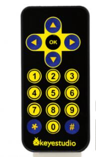
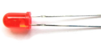
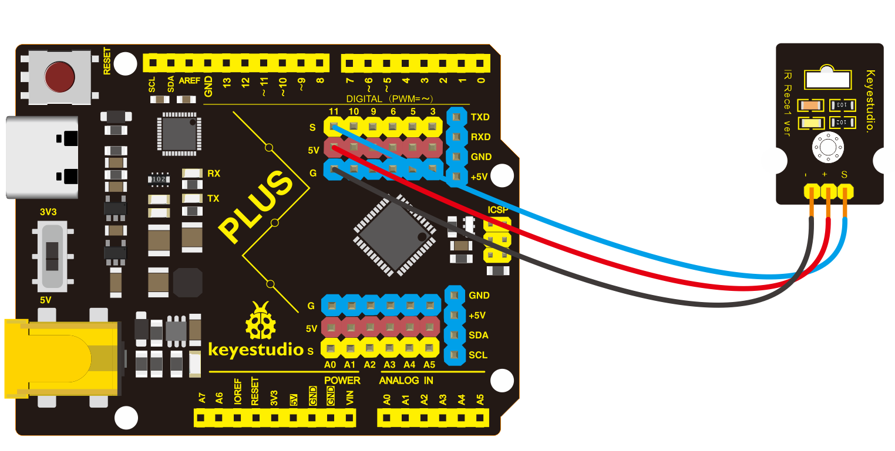
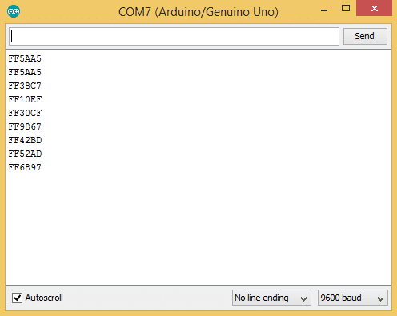
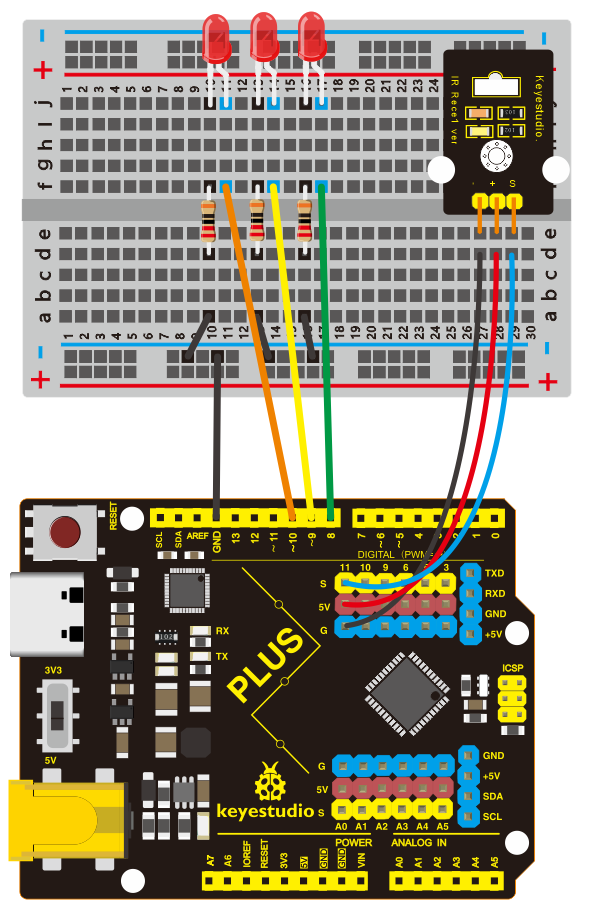
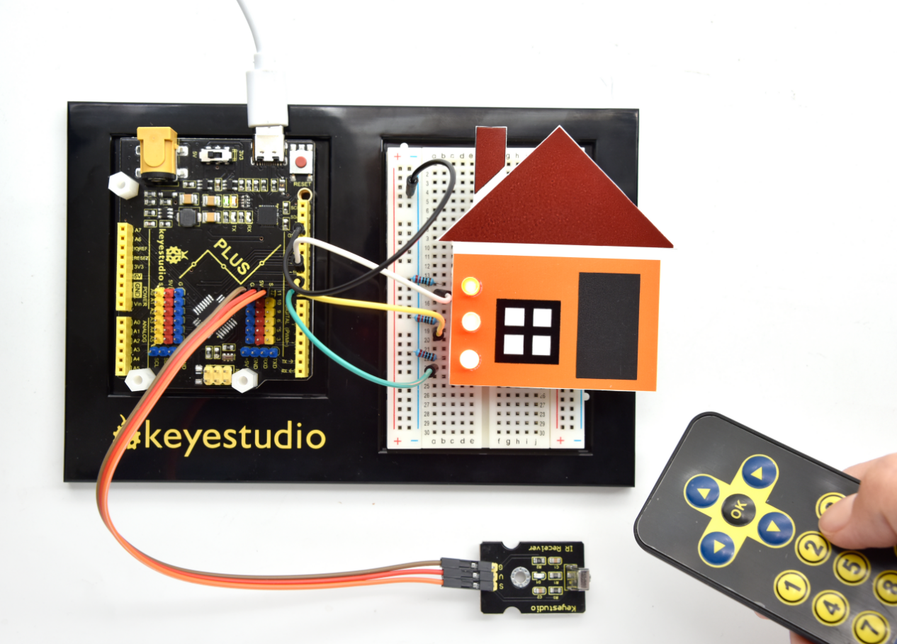

## Project 28: Smart House

**1.Project Introduction**

IR remote is a low-cost and easy to use wireless communication technology. IR
light is very similar to visible light, except that it has a slightly longer
wavelength. This means IR is undetectable to the human eye - perfect for
wireless communication. For example, when you hit a button on your TV remote, an
IR LED repeatedly turns on and off, 38,000 time a second, to transmit
information (like volume or channel control) to an IR photo sensor on your TV.

We will first explain how common IR communication protocols work. Then we will
start this project with a remote control and an infrared receiving component.

We prepare a house cartoon board. When we press the button of the remote
control, the light on the house will be on, press the button again, it will be
off.

**2.Project Hardware**

|    |    |   |   |
|---------------------------------------------------|---------------------------------------------------|--------------------------------------------------|--------------------------------------------------|
| Plus Development Board\*1                         | Plus Board Holder                                 | 400-Hole Breadboard                              | USB Cable\*1                                     |
|  |    |   |   |
| Infrared Remote Controller \*1                    | Red M5 LED \*3                                    | 220Ω Resistor\*3                                 | Infrared Receiver Module\*1                      |
|    |    |                                                  |                                                  |
| Small House Paper Card\*1                         |  Jump Wire \*10+                                  |                                                  |                                                  |

1.  **How does infrared remote works**

**What is infrared?**

Infrared radiation is a form of light similar to the light we see all around us.
The only difference between IR light and visible light is the frequency and
wavelength. Infrared radiation lies outside the range of visible light, so
humans can’t see it:

Because IR is a type of light, IR communication requires a direct line of sight
from the receiver to the transmitter. It can’t transmit through walls or other
materials like WiFi or Bluetooth.

**How IR and receiver work**

A typical infrared communication system requires an IR transmitter and an IR
receiver. The transmitter looks just like a standard LED, except it produces
light in the IR spectrum instead of the visible spectrum. If you have a look at
TV remote, you’ll see the IR transmitter
LED:

The IR receiver is a photodiode and pre-amplifier that converts the IR light
into an electrical signal. IR receiver diodes typically look like this:

**Ir signal modulation**

IR light is emitted by the sun, light bulbs, and anything else that produces
heat. That means there is a lot of IR light noise all around us. To prevent this
noise from interfering with the IR signal, a signal modulation technique is
used.

In IR signal modulation, an encoder on the IR remote converts a binary signal
into a modulated electrical signal. This electrical signal is sent to the
transmitting LED. The transmitting LED converts the modulated electrical signal
into a modulated IR light signal. The IR receiver then demodulates the IR light
signal and converts it back to binary before passing on the information to a
microcontroller:

The modulated IR signal is a series of IR light pulses switched on and off at a
high frequency known as the carrier frequency. The carrier frequency used by
most transmitters is 38 kHz, because it is rare in nature and thus can be
distinguished from ambient noise. This way the IR receiver will know that the 38
kHz signal was sent from the transmitter and not picked up from the surrounding
environment.

The receiver diode detects all frequencies of IR light, but it has a band-pass
filter and only lets through IR at 38 kHz. It then amplifies the modulated
signal with a pre-amplifier and converts it to a binary signal before sending it
to a microcontroller.

**IR Codes**

Each time you press a button on the remote control, a unique hexadecimal code is
generated. This is the information that is modulated and sent over IR to the
receiver. In order to decipher which key is pressed, the receiving
microcontroller needs to know which code corresponds to each key on the remote.

Different remotes send different codes for the keypresses, so you’ll need to
determine the code generated for each key on your particular remote. If you can
find the datasheet, the IR key codes should be listed. If not though, there is a
simple Arduino sketch that will read most of the popular remote controls and
print the hexadecimal codes to the serial monitor when you press a key. I’ll
show you how to set up in a minute, but first we need to connect the receiver to
the Arduino…

**4.Decode the IR Signals**

We connect the infrared receiver module to the Plus development board according
to the wiring diagram below.

**Install the irremote library**

We’ll use the IRremote library for all of the code examples below. You can
download a ZIP file of the library :
[https//github.com/shirriff/Arduino-IRremote](https://github.com/shirriff/Arduino-IRremote).

To install the library from the ZIP file, open up the Arduino IDE, then go to
Sketch \> Include Library \> Add .ZIP Library, then select the IRremote ZIP file
that you downloaded from the link above.

**Find the codes for you remote**

/\*

keyestudio STEM Starter Kit

Project 28.1

Decode the IR signals

http//www.keyestudio.com

\*/

\#include \<IRremote.h\>

int RECV_PIN = 11;

IRrecv irrecv(RECV_PIN);

decode_results results;

void setup()

{

Serial.begin(9600);

irrecv.enableIRIn(); // Start the receiver

}

void loop() {

if (irrecv.decode(&results)) {

Serial.println(results.value, HEX);

irrecv.resume(); // Receive the next value

}

delay(100);

}

////////////////////////////////////////////////////////////////////////////

upload this code to Plus board and open the serial monitor at a baud rate of
9600.

You will see a code on the serial monitor. Press the same button several times
to make sure you have the right code for that button. If you see FFFFFFFF, just
ignore it.

Write down the code associated with each button, because you’ll need that
information later.

**5. Smart House Circuit Connection**

Now I’ll show you how to control the Arduino’s output pins using IR remote. In
this project, we will light up an LED. You can easily modify the code to do
things like control servo motors, or activate relays with any button press from
the remote.

Connect the LEDs with resistors to pin 8, 9, 10.

**6.Project Code**

/\*

keyestudio STEM Starter Kit

Project 28.2

Smart House

http//www.keyestudio.com

\*/

\#include \<IRremote.h\>

int IR_Recv = 11; //IR Receiver Pin 11

int bluePin = 10;

int greenPin = 9;

int yellowPin = 8;

IRrecv irrecv(IR_Recv);

decode_results results;

void setup(){

Serial.begin(9600); //starts serial communication

irrecv.enableIRIn(); // Starts the receiver

pinMode(bluePin, OUTPUT); // sets the digital pin as output

pinMode(greenPin, OUTPUT); // sets the digital pin as output

pinMode(yellowPin, OUTPUT); // sets the digital pin as output

}

void loop(){

//decodes the infrared input

if (irrecv.decode(&results)){

long int decCode = results.value;

Serial.println(results.value);

//switch case to use the selected remote control button

switch (results.value){

case 0x00FF6897: //when you press the 1 button

digitalWrite(bluePin, HIGH);

break;

case 0x00FF30CF: //when you press the 4 button

digitalWrite(bluePin, LOW);

break;

case 0x00FF9867: //when you press the 2 button

digitalWrite(greenPin, HIGH);

break;

case 0x00FF18E7: //when you press the 5 button

digitalWrite(greenPin, LOW);

break;

case 0x00FFB04F: //when you press the 3 button

digitalWrite(yellowPin, HIGH);

break;

case 0x00FF7A85: //when you press the 6 button

digitalWrite(yellowPin, LOW);

break;

}

irrecv.resume(); // Receives the next value from the button you press

}

delay(10);

}//////////////////////////////////////////////////////////////////

**Note :** add IRremote folder into installation directory Arduino compiler
libraries, or you will fail to compile it.

Infrared remote library
[https//github.com/shirriff/Arduino-IRremote](https://github.com/shirriff/Arduino-IRremote)

**7.Project Result**

Upload the code to the development board. Hook up components as follows. Press
button 1 and 4 to turn on and off the first LED. Press button 2 and 5 to control
the second LED. And press button 3 and 6 to control the state of the third LED.

