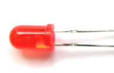

## Project 3: Little Star

****

**1.Project Introduction**

In this project, we will learn the PWM control of ARDUINO. PWM is the
abbreviation of Pulse Width Modulation, which is a technology that encodes
analog signal level into digital signal level.

Here, we use PWM to control the brightness of an LED from bright to dark
gradually. Match our customized star card, you will get a flickering star.

**2.Project Hardware**

|  |  |   |  |
|-------------------------------------------------|-------------------------------------------------|--------------------------------------------------|-------------------------------------------------|
| Plus development Board\*1                       |  Plus Board holder                              | 400-hole Breadboard                              | USB cable\*1                                    |
|  |  |   |  |
| M5 Red LED\*1                                   |  220Ω Resistor\*1                               | Jumper Wire\*2                                   | Cartoon Little Star Card\*1                     |

**3.PWM Working Principle**

PWM stands for Pulse Width Modulation and it is a technique to control LED’s
brightness, speed of DC motor and servo motor.

The Arduino digital pins either produces 5V (when turned HIGH) or 0V (when
turned LOW). Yet, it output a square wave signal. So if we want to dim a LED, we
cannot get the voltage between 0 and 5V from the digital pin but we can change
the ON and OFF time of the signal. If we will change the ON and OFF time fast
enough then the brightness of the led will be changed.

Before going further, let’s discuss some terms associated with PWM.

TON (On Time): It is the time when the signal is high.

TOFF (Off Time): It is the time when the signal is low.

Period: It is the sum of on time and off time.

Duty Cycle: It is the percentage of time when the signal is high during the time
of period.

So at 50% duty cycle and 1Hz frequency, the led will be high for half a second
and will be low for the other half second. If we increase the frequency to 50Hz
(50 times ON and OFF per second), then the led will be seen glowing at half
brightness by the human eye.

**Arduino and PWM**

The Arduino IDE has a built in function “analogWrite()” which can be used to
generate a PWM signal. The frequency of this generated signal for most pins will
be about 490Hz and we can give the value from 0-255 using this function.

analogWrite(0) means a signal of 0% duty cycle.

analogWrite(127) means a signal of 50% duty cycle.

analogWrite(255) means a signal of 100% duty cycle.

On KEYESTUDIO Plus development board, the PWM pins are 3, 5, 6, 9, 10 and 11.

The PWM pins are labeled with \~ sign.

In this project, you are going to learn how to get the PWM output from the
digital pins of Plus development board and control brightness of LED through
code.

**4.Circuit Connection**

How to connect an LED

How to identify 5 band 220Ω Resistor

**5.Project Code**

/\*

keyestudio STEM Starter Kit

Project 3

Little Star

http//www.keyestudio.com

\*/

int ledPin = 6;

void setup()

{

pinMode(ledPin,OUTPUT);

}

void loop(){

for (int value = 0 ; value \< 255; value=value+1){

analogWrite(ledPin, value);

delay(5);

}

for (int value = 255; value \>0; value=value-1){

analogWrite(ledPin, value);

delay(5);

} }

/////////////////////////////////////////////////////////////////

1.Open up the Arduino IDE and copy the below code into a new sketch.

2.Select the correct Board type and COM port for the Arduino IDE.

3.Click Upload button on Arduino IDE to upload code.

**6.Project Result**

Done uploading. You will see the LED lights gradually light up, and then
gradually darken.

We put the card of a star on the LED, it looks like a twinkling star in the sky

