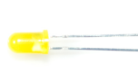

### Project 4: Traffic Light

**1.Project Introduction**

Traffic lights are prevalent in our ordinary life. According to a certain time
rule, lights operate traffic lights with three colors of red, yellow, and green.
Everyone shall abide by traffic regulations, which can avoid many traffic
accidents.

In this project, we will use a plus development board, a traffic light card, and
some LEDs(red, yellow, and green) to simulate a traffic light.

**2.Project Hardware**

|  |    |  |           |  |
|-------------------------------------------------|---------------------------------------------------|-------------------------------------------------|----------------------------------------------------------|-------------------------------------------------|
| Plus Board\*1                                   | Plus Board Holder                                 | 400-Hole Breadboard                             |  USB Cable\*1                                            | Yellow M5 LED\*1                                |
|  |    |  |           |  |
| Green M5 LED\*1                                 | Red M5 LED\*1                                     | 220Ω Resistor\*3                                | **Preformed Jumper Wire\*3** **Flexible jumper Wire\*4** | Traffic Light\*1                                |

**3.Circuit Connection**

**NOTE:**

How to connect an LED

How to identify 5 band 220Ω Resistor

**4.Project Code**

Since it is a simulation of traffic lights, the blinking time of each LED should
be the same as those in traffic lights system.

In this program, we use Arduino **delay ()** function to control delay time,
which is much simpler than C language.

/\*

keyestudio STEM Starter Kit

Project 4

traffic light

http//www.keyestudio.com

\*/

int redled =10; // initialize digital pin 10.

int yellowled =7; // initialize digital pin 7.

int greenled =4; // initialize digital pin 4.

void setup()

{

pinMode(redled, OUTPUT);// set the pin with red LED as “output”

pinMode(yellowled, OUTPUT); // set the pin with yellow LED as “output”

pinMode(greenled, OUTPUT); // set the pin with blue LED as “output”

}

void loop()

{

digitalWrite(greenled, HIGH);//// turn on green LED

delay(5000);// wait 5 seconds

digitalWrite(greenled, LOW); // turn off green LED

for(int i=0;i\<3;i++)// blinks for 3 times

{

delay(500);// wait 0.5 second

digitalWrite(yellowled, HIGH);// turn on yellow LED

delay(500);// wait 0.5 second

digitalWrite(yellowled, LOW);// turn off yellow LED

}

delay(500);// wait 0.5 second

digitalWrite(redled, HIGH);// turn on red LED

delay(5000);// wait 5 second

digitalWrite(redled, LOW);// turn off red LED

}

//////////////////////////////////////////////////////////////////

1.Open up the Arduino IDE and copy the above code into a new sketch.

2.Select the correct Board type and COM port for the Arduino IDE.

3.Click Upload button on Arduino IDE to upload code.

**5.Project Result**

Done uploading. Put the traffic light card on top of the three LEDs, and you
have successfully made a traffic light.

1.  First, the green light will be on for 5 seconds, and then off.

2.  Second, the yellow light will blink for 3 times, and then off.

3.  Third, the red light will be on for 5 seconds, and then off.

4.Continue to run the above 1-3 steps until you cut off the power to the plus
development board.

