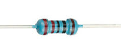
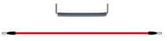

## Project 5: RGB LED

**1.Project Introduction**

The RGB led, consisting of three colors（red, green and blue), can emit
different colors by mixing this 3 basic colors.

In this project, we will introduce you RGB LED and show you how to use the Plus
development board.

We also provide a RGB color card for you to understand it easier. Even though
the RGB LED are extremely basic, it’s a great way to introduce yourself or
others to the basics of electronics and coding.

**2.Project Hardware**

|  |  |             |  |
|-------------------------------------------------|-------------------------------------------------|------------------------------------------------------------|-------------------------------------------------|
| Plus Development Board\*1                       | Plus Board Holder                               | 400-Hole Breadboard                                        | USB Cable\*1                                    |
|  |  |             |  |
| RGB LED \* 1                                    |  220Ω Resistor\*3                               | **Preformed Jumper Wire\*2** **Flexible jumper Wire\*4**   | RGB color Card\*1                               |

**3. Little Knowledge**

The monitors mostly comply with the RGB color standard, and all the colors on
the computer screen are composed of the three colors of red, green and blue
mixed in different proportions.

This RGB LED has 4 pins, one for each color (Red, Green, Blue) and a common
cathode. To change brightness of RGB led, we can use the PWM pins of Arduino.
The PWM pins will give signal with different duty cycles to the RGB led to
obtain different colors.

**4.Circuit Connection**

**NOTE：**

The longest pin (common cathode) of RGB LED is connected to GND.

How to identify 5 band 220Ω Resistor

**5.Project Code**

/\*

keyestudio STEM Starter Kit

Project 5

Color Secret

http//www.keyestudio.com

\*/

int redpin = 11; //select the pin for the red LED

int bluepin =9; // select the pin for the blue LED

int greenpin =10;// select the pin for the green LED

int val;

void setup() {

pinMode(redpin, OUTPUT);

pinMode(bluepin, OUTPUT);

pinMode(greenpin, OUTPUT);

Serial.begin(9600);

}

void loop()

{

for(val=255; val\>0; val--)

{

analogWrite(11, val);

analogWrite(10, 255-val);

analogWrite(9, 128-val);

delay(1);

}

for(val=0; val\<255; val++)

{

analogWrite(11, val);

analogWrite(10, 255-val);

analogWrite(9, 128-val);

delay(1);

}

Serial.println(val, DEC);

}

//////////////////////////////////////////////////////////////////

1.Open up the Arduino IDE and copy the above code into a new sketch.

2.Select the correct Board type and COM port for the Arduino IDE.

3.Click Upload button to upload the code.

**6.Project Result**

Done uploading! Wait for a few seconds, you can see a colorful LED. You can also
put the RGB card we provide on top of it.

