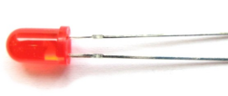

**Project 6: Battery Billboard**

**1.Project Introduction**

We can see many billboards composed of different colour LEDs in daily life. They
are constantly changing their light to attract customers' attention.

In this project, we will use 5 LEDs and a battery paper card to make an
advertising panel about the battery. The sparkling light string makes it easy
for customers to notice your battery if you are a battery salesperson.

1.  **Project Hardware**

|  |  |   |  |
|-------------------------------------------------|-------------------------------------------------|--------------------------------------------------|-------------------------------------------------|
| Plus Development Board\*1                       |  Plus Board Holder                              | 400-Hole Breadboard                              | USB Cable\*1                                    |
|  |  |   |  |
| Red M5 LED\*5                                   | 220Ω Resistor\*5                                | Preformed Jumper Wire\*5 Flexible jumper Wire\*6 | battery billboard Card\*1                       |

**3.Circuit Connection**

**NOTE:**

How to connect an LED

How to identify 5 band 220Ω Resistor

**4.Project Code**

/\*

keyestudio STEM Starter Kit

Project 6

**Advertising running lights**

http//www.keyestudio.com

\*/

int BASE = 2 ;// the I/O pin for the first LED

int NUM = 5; // number of LEDs

void setup()

{

for (int i = BASE; i \< BASE + NUM; i ++)

{

pinMode(i, OUTPUT); // set I/O pins as output

}

}

void loop()

{

for (int i = BASE; i \< BASE + NUM; i ++)

{

digitalWrite(i, LOW); // set I/O pins as “low”, turn off LEDs one by one.

delay(200); // delay

}

for (int i = BASE; i \< BASE + NUM; i ++)

{

digitalWrite(i, HIGH); // set I/O pins as “high”, turn on LEDs one by one

delay(200); // delay

}

}

//////////////////////////////////////////////////////////////////

1.Open up the Arduino IDE and copy the above code into a new sketch.

2.Select the correct Board type and COM port for the Arduino IDE.

3.Click Upload button to upload the code.

**5.Project Result**

Done uploading！The 5 LEDs connected to the D2-D6 pins of the development board
will gradually light up and then gradually turn off, just like a battery being
charged.

