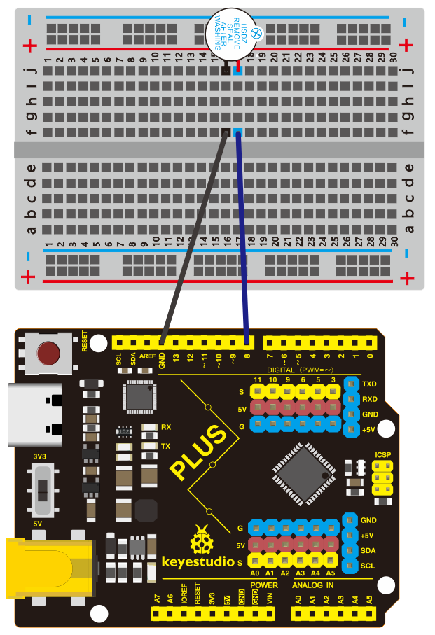
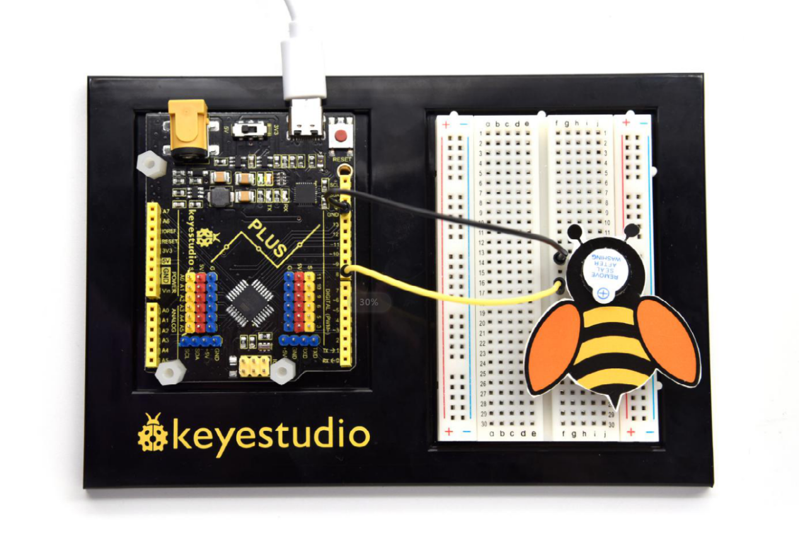

## Project 7: Little Bee

**1.Project Introduction**

The active buzzer is a sounding component. it is widely used as a sound-making
element on the computer, printer, alarm, electronic toy, telephone, timer and
more. It has an inner vibration source. Simply connect it with 5V power supply,
it can buzz continuously.

In this project, we will use an active buzzer and a cartoon bee card to make a
cute bee that can tweet.

**2.Project Hardware**

|                          |   |  |  |
|-------------------------------------------------------------------------|--------------------------------------------------|-------------------------------------------------|-------------------------------------------------|
| Plus Development Board\*1                                               |  Plus Board Holder                               | 400-Hole Breadboard                             | USB Cable\*1                                    |
|  |   |  |                                                 |
| Active buzzer\*1                                                        | Jumper Wire\*2                                   | Cartoon Small Bee Card\*1                       |                                                 |

**3. Little Knowledge**

The active buzzer inside has a simple oscillator circuit which can convert
constant direct current into a certain frequency pulse signal. Once active
buzzer receives a high level, it will produce an audible beep.

Passive buzzer is an integrated electronic buzzer without vibration source
inside. It must be driven by 2K-5K square wave instead of direct current
signals.

The appearance of the two buzzers is very similar, but the one with a green
circuit board is a passive buzzer, while the other enclosed with a black tape is
an active one. Passive buzzers don't differentiate positive while active
polarity active buzzers do.

As shown below:

**4.Circuit Connection**

NOTE：Note: The positive pole of the active buzzer is connected to pin 8
("+"/long pin), and the negative pole is connected to GND

**5.Project Code**

/\*

keyestudio STEM Starter Kit

Project 7

Little bee

http//www.keyestudio.com

\*/

int buzzerPin = 8;

void setup ()

{

pinMode (buzzerPin, OUTPUT);

}

void loop ()

{

digitalWrite (buzzerPin, HIGH);

delay (500);

digitalWrite (buzzerPin, LOW);

delay (500);

}

//////////////////////////////////////////////////////////////////

1.Open up the Arduino IDE and copy the above code into a new sketch.

2.Select the correct Board type and COM port for the Arduino IDE.

3.Click Upload button to upload the code.

**6.Project Result**

Done uploading！Put the cartoon paper of the little bee on it, You will get a
little bee that can tweet.

