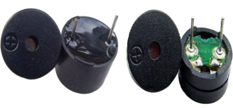

## Project 8: Bird That Can Sing

**1.Project Introduction**

In the previous project, we studied the active buzzer, which can only emit one
sound and may make you feel monotonous.

This project will learn another buzzer, passive buzzer. Unlike an active buzzer,
a passive buzzer can emit sounds of different frequencies.

In this project, you will get a bird that can sing which is made by a cartoon
bird card and the passive buzzer we provide.

**2.Project Hardware**

|                         |    |  |  |
|------------------------------------------------------------------------|---------------------------------------------------|-------------------------------------------------|-------------------------------------------------|
| Plus Development Board\*1                                              | Plus Board Holder                                 | 400-Hole Breadboard                             | USB Cable\*1                                    |
|  |    |  |                                                 |
| Passive Buzzer\*1                                                      | Jumper Wire\*2                                    | Cartoon Small Bird Card\*1                      |                                                 |

**3. Little knowledge**

Passive buzzer is an integrated electronic buzzer without vibration source
inside. It must be driven by 2K-5K square wave instead of direct current
signals. The appearance of the two buzzers is very similar, but the one with a
green circuit board is a passive buzzer, while the other enclosed with a black
tape is an active one. Passive buzzers don't differentiate positive while active
polarity active buzzers do.

**4.Circuit Connection**

**5.Project Code**

/\*

keyestudio STEM Starter Kit

Project 8

Singing bird

http//www.keyestudio.com

\*/

\#define NOTE_B0 31

\#define NOTE_C1 33

\#define NOTE_CS1 35

\#define NOTE_D1 37

\#define NOTE_DS1 39

\#define NOTE_E1 41

\#define NOTE_F1 44

\#define NOTE_FS1 46

\#define NOTE_G1 49

\#define NOTE_GS1 52

\#define NOTE_A1 55

\#define NOTE_AS1 58

\#define NOTE_B1 62

\#define NOTE_C2 65

\#define NOTE_CS2 69

\#define NOTE_D2 73

\#define NOTE_DS2 78

\#define NOTE_E2 82

\#define NOTE_F2 87

\#define NOTE_FS2 93

\#define NOTE_G2 98

\#define NOTE_GS2 104

\#define NOTE_A2 110

\#define NOTE_AS2 117

\#define NOTE_B2 123

\#define NOTE_C3 131

\#define NOTE_CS3 139

\#define NOTE_D3 147

\#define NOTE_DS3 156

\#define NOTE_E3 165

\#define NOTE_F3 175

\#define NOTE_FS3 185

\#define NOTE_G3 196

\#define NOTE_GS3 208

\#define NOTE_A3 220

\#define NOTE_AS3 233

\#define NOTE_B3 247

\#define NOTE_C4 262

\#define NOTE_CS4 277

\#define NOTE_D4 294

\#define NOTE_DS4 311

\#define NOTE_E4 330

\#define NOTE_F4 349

\#define NOTE_FS4 370

\#define NOTE_G4 392

\#define NOTE_GS4 415

\#define NOTE_A4 440

\#define NOTE_AS4 466

\#define NOTE_B4 494

\#define NOTE_C5 523

\#define NOTE_CS5 554

\#define NOTE_D5 587

\#define NOTE_DS5 622

\#define NOTE_E5 659

\#define NOTE_F5 698

\#define NOTE_FS5 740

\#define NOTE_G5 784

\#define NOTE_GS5 831

\#define NOTE_A5 880

\#define NOTE_AS5 932

\#define NOTE_B5 988

\#define NOTE_C6 1047

\#define NOTE_CS6 1109

\#define NOTE_D6 1175

\#define NOTE_DS6 1245

\#define NOTE_E6 1319

\#define NOTE_F6 1397

\#define NOTE_FS6 1480

\#define NOTE_G6 1568

\#define NOTE_GS6 1661

\#define NOTE_A6 1760

\#define NOTE_AS6 1865

\#define NOTE_B6 1976

\#define NOTE_C7 2093

\#define NOTE_CS7 2217

\#define NOTE_D7 2349

\#define NOTE_DS7 2489

\#define NOTE_E7 2637

\#define NOTE_F7 2794

\#define NOTE_FS7 2960

\#define NOTE_G7 3136

\#define NOTE_GS7 3322

\#define NOTE_A7 3520

\#define NOTE_AS7 3729

\#define NOTE_B7 3951

\#define NOTE_C8 4186

\#define NOTE_CS8 4435

\#define NOTE_D8 4699

\#define NOTE_DS8 4978

\#define REST 0

int tempo=114; // change this to make the song slower or faster

int buzzer = 8;// change this to whichever pin you want to use

// notes of the moledy followed by the duration.

// a 4 means a quarter note, 8 an eighteenth , 16 sixteenth, so on

// !!negative numbers are used to represent dotted notes,

// so -4 means a dotted quarter note, that is, a quarter Plus an eighteenth!!

int melody[] = {

NOTE_E4,4, NOTE_E4,4, NOTE_F4,4, NOTE_G4,4,//1

NOTE_G4,4, NOTE_F4,4, NOTE_E4,4, NOTE_D4,4,

NOTE_C4,4, NOTE_C4,4, NOTE_D4,4, NOTE_E4,4,

NOTE_E4,-4, NOTE_D4,8, NOTE_D4,2,

NOTE_E4,4, NOTE_E4,4, NOTE_F4,4, NOTE_G4,4,//4

NOTE_G4,4, NOTE_F4,4, NOTE_E4,4, NOTE_D4,4,

NOTE_C4,4, NOTE_C4,4, NOTE_D4,4, NOTE_E4,4,

NOTE_D4,-4, NOTE_C4,8, NOTE_C4,2,

NOTE_D4,4, NOTE_D4,4, NOTE_E4,4, NOTE_C4,4,//8

NOTE_D4,4, NOTE_E4,8, NOTE_F4,8, NOTE_E4,4, NOTE_C4,4,

NOTE_D4,4, NOTE_E4,8, NOTE_F4,8, NOTE_E4,4, NOTE_D4,4,

NOTE_C4,4, NOTE_D4,4, NOTE_G3,2,

NOTE_E4,4, NOTE_E4,4, NOTE_F4,4, NOTE_G4,4,//12

NOTE_G4,4, NOTE_F4,4, NOTE_E4,4, NOTE_D4,4,

NOTE_C4,4, NOTE_C4,4, NOTE_D4,4, NOTE_E4,4,

NOTE_D4,-4, NOTE_C4,8, NOTE_C4,2

};

// sizeof gives the number of bytes, each int value is composed of two bytes (16
bits)

// there are two values per note (pitch and duration), so for each note there
are four bytes

int notes=sizeof(melody)/sizeof(melody[0])/2;

// this calculates the duration of a whole note in ms (60s/tempo)\*4 beats

int wholenote = (60000 \* 4) / tempo;

int divider = 0, noteDuration = 0;

void setup() {

// iterate over the notes of the melody.

// Remember, the array is twice the number of notes (notes + durations)

for (int thisNote = 0; thisNote \< notes \* 2; thisNote = thisNote + 2) {

// calculates the duration of each note

divider = melody[thisNote + 1];

if (divider \> 0) {

noteDuration = (wholenote) / divider; // regular note, just proceed

} else if (divider \< 0) {

// dotted notes are represented with negative durations!!

noteDuration = (wholenote) / abs(divider);

noteDuration \*= 1.5; // increases the duration in half for dotted notes

}

// we only play the note for 90% of the duration, leaving 10% as a pause

tone(buzzer, melody[thisNote], noteDuration\*0.9);

// Wait for the specief duration before playing the next note.

delay(noteDuration);

noTone(buzzer); // stop the waveform generation before the next note.

}

}

void loop() {

// if you want to repeat the song forever, paste the setup code here .

}

/////////////////////////////////////////////////////////////////

1.Open up the Arduino IDE and copy the above code into a new sketch.

2.Select the correct Board type and COM port for the Arduino IDE.

3.Click Upload button to upload the code.

**6.Project Result**

Upload the project code to the Plus development board.

Put the cartoon paper of the bird on it, and can get a bird that can sing a nice
song.

