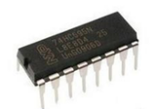
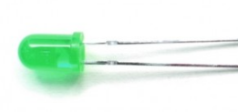

## Project 9: Laser Bar

**1.Project Introduction**

In the previous project, we have learned how to light up a LED. There are only
22 IO ports on the Plus development board. How can we light up a large number of
LEDs? At sometime may run out of pins on your Arduino board and need to extend
it with shift registers.

You can use the 74HC595N to control 8 outputs at a time while only taking up a
few pins on your microcontroller. You can also link multiple registers together
to extend your output even more.

In this project, we will use 4 Red M5 LEDs, 3 Green M5 LEDs and the laser stick
card we provide to make an exciting laser stick model.

**2.Project Hardware**

|  |   |  |  |
|-------------------------------------------------|--------------------------------------------------|-------------------------------------------------|-------------------------------------------------|
| Plus Development Board\*1                       | Plus Board Holder                                | 400-Hole Breadboard                             | USB Cable\*1                                    |
|  |   |  |  |
| 74HC595 chip\*1                                 | Red M5 LED \*4                                   | Green M5 LED \*3                                | 220Ω Resistor\*7                                |
|  |   |                                                 |                                                 |
| Preformed/Flaxible Jumper Wire\*20+             | Laser Stick Paper Card\*1                        |                                                 |                                                 |

1.  **74HC595 Chip Pins Description：**

| Pins No | Name  | Function                     |
|---------|-------|------------------------------|
| 1-7, 15 | Q0-Q7 | Parallel Output              |
| 8       | GND   | GND                          |
| 9       | MR    | Serial Output                |
| 10      |       | Master Reserve , connect 5V  |
| 11      | SH_CP | Shift Register Clock Output  |
| 12      | ST_CP | Storage Register Clock Input |
| 13      | OE    | Output Enable (active LOW)   |
| 14      | DS    | Serial data input            |
| 16      | Vcc   | 5V working voltage           |

-   VCC and GND are used to supply power for chip, the working voltage is 5V.

-   Q0\~Q7:This eight pins are output pins.

-   DS pin is serial input pin, we need to write data into this pin by bit.

-   STCP is a latch pin. The data can be copied to latch and output in parallel
    after 8-digit data of latch is all transmitted.

-   SHCP is a clock pin. The data can be written into storage register.

-   OE is an output enable pin, which is used to make sure if the data of latch
    is input into Q0-Q7 pins. When in low level, high level is not output. In
    this experiment, we directly connect to GND to keep low level output data.

-   MR is a pin to initialize the pin of storage register. Initialize the
    internal storage register when low level. In this experiment, we connect to
    VCC to keep high level.

-   Q7S pin is a serial output pin, which is specially used for chip cascade.

**4.Circuit Connection**

**NOTE：**Pay attention to the inserting direction of 74HC595N

**5.Project Code**

/\*

keyestudio STEM Starter Kit

Project 9

Star Wars Laser Rod

http//www.keyestudio.com

\*/

int data = 4;// set pin 4 of 74HC595as data input pin SI

int clock = 6;// set pin 6 of 74hc595 as clock pin SCK

int latch = 5;// set pin 5 of 74hc595 as output latch RCK

int ledState = 0;

const int ON = HIGH;

const int OFF = LOW;

void setup()

{

pinMode(data, OUTPUT);

pinMode(clock, OUTPUT);

pinMode(latch, OUTPUT);

}

void loop()

{

for(int i = 0; i \< 256; i++)

{

updateLEDs(i);

delay(500);

}

}

void updateLEDs(int value)

{

digitalWrite(latch, LOW);//

shiftOut(data, clock, MSBFIRST, \~value);// serial data “output”, high level
first

digitalWrite(latch, HIGH);// latch

}

//////////////////////////////////////////////////////////////////

1.Open up the Arduino IDE and copy the above code into a new sketch.

2.Select the correct Board type and COM port for the Arduino IDE.

3.Click Upload button to upload the code.

**6.Project Result**

Done uploading！

Put the Laser stick paper card on the LED, you can see 7 LEDs are light one by
one, Just like a laser stick full of power.

